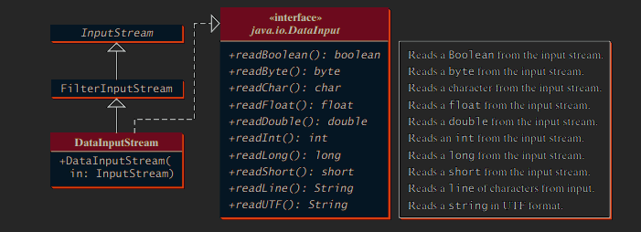

<!-- TOC -->
# INDEX

- [INDEX](#index)
- [Differences between Java and C++](#differences-between-java-and-c)
  - [Unlike C++, Java is NOT pass-by-reference](#unlike-c-java-is-not-pass-by-reference)
  - [C++ has Destructors, Java has Finalization](#c-has-destructors-java-has-finalization)
  - [Multiple Inheritance](#multiple-inheritance)
- [Naming Conventions in Java](#naming-conventions-in-java)
- [How Java code executes](#how-java-code-executes)
- [Platform independence of Java and difference from C++](#platform-independence-of-java-and-difference-from-c)
  - [Byte code vs. Source code](#byte-code-vs-source-code)
- [JDK vs. JRE vs. JVM vs. JIT](#jdk-vs-jre-vs-jvm-vs-jit)
  - [JDK (Java Development Kit)](#jdk-java-development-kit)
    - [More about `javadoc`](#more-about-javadoc)
      - [Where should we put comments for `javadoc`?](#where-should-we-put-comments-for-javadoc)
  - [JRE (Java Runtime Environment)](#jre-java-runtime-environment)
  - [JVM (Java Virtual Machine)](#jvm-java-virtual-machine)
    - [Class Loader Subsystem](#class-loader-subsystem)
      - [Loading](#loading)
      - [Linking](#linking)
      - [Initialization](#initialization)
    - [Execution Engine](#execution-engine)
      - [Java Interpreter](#java-interpreter)
      - [`JIT` (Just-In-Time) compiler](#jit-just-in-time-compiler)
      - [Garbage Collector](#garbage-collector)
    - [Runtime Data Areas](#runtime-data-areas)
- [What is a Specification?](#what-is-a-specification)
- [Basic Java program](#basic-java-program)
  - [Packages in Java](#packages-in-java)
    - [Creating a Package](#creating-a-package)
    - [Naming convention for packages](#naming-convention-for-packages)
    - [Dynamically importing classes from packages in Java](#dynamically-importing-classes-from-packages-in-java)
    - [Some in-built packages...](#some-in-built-packages)
      - [`java.lang`](#javalang)
      - [`java.io`](#javaio)
      - [`java.util`](#javautil)
  - [Access Modifiers in Java](#access-modifiers-in-java)
    - [Reference Variable Controls Access](#reference-variable-controls-access)
    - [Upcasting in Java](#upcasting-in-java)
    - [Downcasting in Java (NOT possible directly)](#downcasting-in-java-not-possible-directly)
  - [Non-Access Modifiers](#non-access-modifiers)
    - [`final` keyword](#final-keyword)
      - [**`final` variable**](#final-variable)
      - [`final` method](#final-method)
      - [`final` class](#final-class)
  - [Classes in Java](#classes-in-java)
    - [`java.lang.Object` class](#javalangobject-class)
    - [Multiple classes in one source file](#multiple-classes-in-one-source-file)
    - [`public class` vs. `class`](#public-class-vs-class)
    - [Creating an Object of a Class (Using CONSTRUCTORS)](#creating-an-object-of-a-class-using-constructors)
    - [Calling of Parent CONSTRUCTOR upon instantiating child class](#calling-of-parent-constructor-upon-instantiating-child-class)
    - [`this` keyword](#this-keyword)
      - [Real usage of the `this()` constructor call (*Constructor Chaining*)](#real-usage-of-the-this-constructor-call-constructor-chaining)
    - [`new` keyword (Request for memory allocation at run-time)](#new-keyword-request-for-memory-allocation-at-run-time)
    - [`super` keyword](#super-keyword)
      - [Real usage of the `super()` constructor call (*Constructor Chaining*)](#real-usage-of-the-super-constructor-call-constructor-chaining)
    - [Wrapper Classes in Java](#wrapper-classes-in-java)
      - [**Need of Wrapper Classes**](#need-of-wrapper-classes)
      - [Autoboxing](#autoboxing)
      - [Unboxing](#unboxing)
    - [`java.util.Random` class (Generating Random Numbers)](#javautilrandom-class-generating-random-numbers)
      - [`nextInt()` method](#nextint-method)
      - [`doubles()`, `ints()` and `longs()`  method](#doubles-ints-and-longs--method)
    - [`java.lang.Math` class](#javalangmath-class)
      - [`Math.random()`](#mathrandom)
      - [Getting a random floating-point number between 2 bounds using `Math`](#getting-a-random-floating-point-number-between-2-bounds-using-math)
      - [Getting a random integer between 2 bounds using `Math`](#getting-a-random-integer-between-2-bounds-using-math)
- [Primitive Data Types in Java](#primitive-data-types-in-java)
  - [`int`](#int)
  - [`byte`](#byte)
  - [`char`](#char)
    - [What is Unicode?](#what-is-unicode)
    - [Difference between ASCII and Unicode](#difference-between-ascii-and-unicode)
- [Non-Primitive data types in Java](#non-primitive-data-types-in-java)
  - [`java.lang.String` (Strings in Java)](#javalangstring-strings-in-java)
    - [Comparing `String` objects in Java](#comparing-string-objects-in-java)
    - [Methods for comparing strings by-value](#methods-for-comparing-strings-by-value)
    - [Strings support concatenation](#strings-support-concatenation)
  - [`java.lang.Character` (Wrapper class for `char` primitive)](#javalangcharacter-wrapper-class-for-char-primitive)
  - [`java.lang.Double`](#javalangdouble)
    - [Infinity in Java](#infinity-in-java)
  - [Arrays](#arrays)
    - [Declaring, Creating & Initializing an Array of PRIMITIVES](#declaring-creating--initializing-an-array-of-primitives)
    - [Default Initialization Value for `int` arrays](#default-initialization-value-for-int-arrays)
    - [Default Initialization Value for `char` Arrays](#default-initialization-value-for-char-arrays)
    - [Specifying the number of elements in an Array](#specifying-the-number-of-elements-in-an-array)
    - [Creating a copy of an Array](#creating-a-copy-of-an-array)
      - [**Assigning the SAME object to a different reference variable**](#assigning-the-same-object-to-a-different-reference-variable)
      - [**Creating a NEW object using `clone()` NON-STATIC method and assigning it to a different reference variable**](#creating-a-new-object-using-clone-non-static-method-and-assigning-it-to-a-different-reference-variable)
    - [Declaring, Creating & Initializing an Array of NON-Primitives (`Objects`, other `Arrays`, etcetera)](#declaring-creating--initializing-an-array-of-non-primitives-objects-other-arrays-etcetera)
  - [`java.lang.reflect.Array` vs. `java.util.Arrays`](#javalangreflectarray-vs-javautilarrays)
    - [`java.lang.reflect.Array`:](#javalangreflectarray)
    - [`java.util.Arrays`:](#javautilarrays)
      - [Printing an Array `java.util.Arrays.toString(Object[] arr)`](#printing-an-array-javautilarraystostringobject-arr)
      - [Copying a portion of an Array `java.util.Arrays.copyOfRange(Object[] arr, int from, int to)`](#copying-a-portion-of-an-array-javautilarrayscopyofrangeobject-arr-int-from-int-to)
  - [Objects](#objects)
    - [Default Initialization value of Objects or types that are Objects](#default-initialization-value-of-objects-or-types-that-are-objects)
    - [Hashcode of an Object](#hashcode-of-an-object)
    - [Collisions in HashCode](#collisions-in-hashcode)
    - [Displaying an Object](#displaying-an-object)
    - [Overriding the `toString()` method of global class `Object`](#overriding-the-tostring-method-of-global-class-object)
  - [Streams (`java.util.stream`)](#streams-javautilstream)
    - [Converting Streams to Arrays : `toArray()`](#converting-streams-to-arrays--toarray)
- [Information related to Data-types](#information-related-to-data-types)
  - [Type-casting in Java (Forcing Lossy Conversions)](#type-casting-in-java-forcing-lossy-conversions)
  - [Automatic Type Conversion in Expressions in Java](#automatic-type-conversion-in-expressions-in-java)
  - [Brackets & Operator Precedence](#brackets--operator-precedence)
- [Conditional and Looping Statements](#conditional-and-looping-statements)
  - [if-else statements](#if-else-statements)
  - [`for-each` loop (looping through Array elements)](#for-each-loop-looping-through-array-elements)
  - [switch-case](#switch-case)
- [Taking Input in Java using `Scanner` class](#taking-input-in-java-using-scanner-class)
  - [Taking input of `int`](#taking-input-of-int)
  - [Taking input of `String`](#taking-input-of-string)
    - [Taking input of one word](#taking-input-of-one-word)
    - [Taking input of multiple words](#taking-input-of-multiple-words)
  - [Taking input of one character (`char`)](#taking-input-of-one-character-char)
  - [Checking if input stream still has data left](#checking-if-input-stream-still-has-data-left)
  - [Special cases while taking input shown practically](#special-cases-while-taking-input-shown-practically)
  - [Discarding input in case of unsuccessful scanning](#discarding-input-in-case-of-unsuccessful-scanning)
- [Functions in Java](#functions-in-java)
  - [Return values](#return-values)
  - [No pass-by-reference](#no-pass-by-reference)
  - [References in Modern Languages](#references-in-modern-languages)
  - [Java NOT having pointers](#java-not-having-pointers)
- [Types of Polymorphism in Java](#types-of-polymorphism-in-java)
  - [Compile-time Polymorphism (Method & Operator Overloading)](#compile-time-polymorphism-method--operator-overloading)
  - [Run-time Polymorphism (Method Overriding)](#run-time-polymorphism-method-overriding)
    - [Dynamic Method Dispatch](#dynamic-method-dispatch)
    - [Overriding Static Methods (NOT POSSIBLE)](#overriding-static-methods-not-possible)
    - [Run-time Polymorphism with Data Members (NOT POSSIBLE)](#run-time-polymorphism-with-data-members-not-possible)
  - [Abstraction in Java](#abstraction-in-java)
    - [Abstract Classes (0-100% Abstraction)](#abstract-classes-0-100-abstraction)
    - [Interfaces (100% Abstraction)](#interfaces-100-abstraction)
    - [Multiple Inheritance using Interfaces](#multiple-inheritance-using-interfaces)
- [Error Handling](#error-handling)
  - [Advantage of using Exception Handling](#advantage-of-using-exception-handling)
  - [What does JVM do when an exception occurs?](#what-does-jvm-do-when-an-exception-occurs)
  - [When NOT to use `try-catch` for exception handling](#when-not-to-use-try-catch-for-exception-handling)
  - [Integer division vs. Floating-point division](#integer-division-vs-floating-point-division)
  - [Mandatory to handle exception EXPLICITLY thrown using `throw` keyword](#mandatory-to-handle-exception-explicitly-thrown-using-throw-keyword)
  - [Types of throwables](#types-of-throwables)
    - [Compile-time `Throwable`s (Checked Exceptions)](#compile-time-throwables-checked-exceptions)
    - [Runtime Throwables](#runtime-throwables)
      - [Errors at run-time (external)](#errors-at-run-time-external)
      - [Exceptions at run-time (internal)](#exceptions-at-run-time-internal)
  - [`toString()` pre-defined overloaded definition of `Throwable` class](#tostring-pre-defined-overloaded-definition-of-throwable-class)
  - [More than one exception in `try` block](#more-than-one-exception-in-try-block)
  - [Catching Exceptions](#catching-exceptions)
  - [Catching exception of `Throwable` sub-classes and super-classes](#catching-exception-of-throwable-sub-classes-and-super-classes)
  - [`finally` block](#finally-block)
  - [Declaration of exceptions that may be thrown using `throws` keyword](#declaration-of-exceptions-that-may-be-thrown-using-throws-keyword)
    - [Which exception should be declared?](#which-exception-should-be-declared)
    - [Practical specialities of declaring an exception](#practical-specialities-of-declaring-an-exception)
  - [Contexts of Exceptions](#contexts-of-exceptions)
  - [Getting information from `Throwable`s](#getting-information-from-throwables)
  - [Rethrowing Exceptions](#rethrowing-exceptions)
  - [Chained Exceptions](#chained-exceptions)
  - [User-defined exceptions](#user-defined-exceptions)
- [File Handling](#file-handling)
  - [`File` class of Java](#file-class-of-java)
    - [Information about a `File` object](#information-about-a-file-object)
    - [Member functions of `File` class](#member-functions-of-file-class)
    - [Renaming a file using `renameTo()` NON-static member function](#renaming-a-file-using-renameto-non-static-member-function)
  - [`PrintWriter` class in Java (for writing text data to a file)](#printwriter-class-in-java-for-writing-text-data-to-a-file)
    - [Some important characteristics](#some-important-characteristics)
    - [Autoclosing files opened by `PrintWriter` using `try-with-resources` block](#autoclosing-files-opened-by-printwriter-using-try-with-resources-block)
  - [Reading files using `Scanner` class](#reading-files-using-scanner-class)
  - [`FileReader`/`FileWriter`](#filereaderfilewriter)
    - [Difference between `FileWriter` and `PrintWriter`](#difference-between-filewriter-and-printwriter)
    - [Difference between `FileReader` and `Scanner`](#difference-between-filereader-and-scanner)
  - [`BufferedReader`/`BufferedWriter`](#bufferedreaderbufferedwriter)
    - [`BufferedWriter` vs. `FileWriter`](#bufferedwriter-vs-filewriter)
- [Binary Files vs. Text Files](#binary-files-vs-text-files)
- [Binary I/O Classes](#binary-io-classes)
  - [`FileInputStream`/`FileOutputStream`](#fileinputstreamfileoutputstream)
    - [Combining `Scanner`/`PrintWriter` with `FileInputStream`/`FileOutputStream`](#combining-scannerprintwriter-with-fileinputstreamfileoutputstream)
    - [Using `getBytes()` method with `FileInputStream`/`FileOutputStream`](#using-getbytes-method-with-fileinputstreamfileoutputstream)
  - [`FilterInputStream`/`FilterOutputStream`](#filterinputstreamfilteroutputstream)
  - [`DataInputStream`/`DataOutputStream`](#datainputstreamdataoutputstream)
    - [`available()` method of `DataInputStream` class vs. catching `EOFException`](#available-method-of-datainputstream-class-vs-catching-eofexception)
    - [`DataOutputStream` member functions](#dataoutputstream-member-functions)
    - [`DataInputStream` member functions](#datainputstream-member-functions)
  - [`BufferInputStream`/`BufferOutputStream`](#bufferinputstreambufferoutputstream)
  - [`ObjectInputStream`/`ObjectOutputStream`](#objectinputstreamobjectoutputstream)
    - [`transient` keyword](#transient-keyword)
- [`Comparable` interface](#comparable-interface)
- [Generics (similar to templates in C++)](#generics-similar-to-templates-in-c)
  - [Placing the formal generic type(s) (`<T>` or `<T1, T2, T3>`)](#placing-the-formal-generic-types-t-or-t1-t2-t3)
  - [Example usage of Generics](#example-usage-of-generics)
    - [Generic methods](#generic-methods)
    - [Generic Methods with Multiple type parameters](#generic-methods-with-multiple-type-parameters)
    - [Generic Classes](#generic-classes)
- [`Collections` Interface](#collections-interface)
  - [`Iterator`s](#iterators)
    - [`ListIterator`](#listiterator)
  - [List](#list)
    - [Methods of List interface](#methods-of-list-interface)
    - [ArrayLists](#arraylists)
      - [Code-snippet demonstrating ArrayList methods:](#code-snippet-demonstrating-arraylist-methods)
- [Maps](#maps)
  - [Map Interface Methods](#map-interface-methods)
  - [`HashMap`, `LinkedHashMap` and `TreeMap` methods](#hashmap-linkedhashmap-and-treemap-methods)
- [Important Useful Methods in Java](#important-useful-methods-in-java)
  - [For Strings](#for-strings)
    - [`charAt()` NON-STATIC method for selecting a single character in a string](#charat-non-static-method-for-selecting-a-single-character-in-a-string)
    - [`equals()` NON-STATIC method for comparing the values of two strings, instead of their storage locations (*collision resolved hash codes*)](#equals-non-static-method-for-comparing-the-values-of-two-strings-instead-of-their-storage-locations-collision-resolved-hash-codes)
    - [`split()` NON-STATIC method for splitting a string using specific delimiters](#split-non-static-method-for-splitting-a-string-using-specific-delimiters)
    - [`replace()` NON-STATIC method to replace characters OR sub-strings in a String](#replace-non-static-method-to-replace-characters-or-sub-strings-in-a-string)
    - [`substring()` NON-STATIC method for obtaining sub-strings restricted by index position inside a String](#substring-non-static-method-for-obtaining-sub-strings-restricted-by-index-position-inside-a-string)
    - [`indexOf()` NON-STATIC method for obtaining starting index positions of sub-strings OR characters in a String](#indexof-non-static-method-for-obtaining-starting-index-positions-of-sub-strings-or-characters-in-a-string)
    - [`toCharArray()` NON-STATIC method for obtaining a character array containing all characters of a String](#tochararray-non-static-method-for-obtaining-a-character-array-containing-all-characters-of-a-string)
    - [`trim()` NON-STATIC method for removing leading and trailing whitespaces from a string](#trim-non-static-method-for-removing-leading-and-trailing-whitespaces-from-a-string)
    - [`getBytes()` NON-STATIC method for obtaining the byte array of a string](#getbytes-non-static-method-for-obtaining-the-byte-array-of-a-string)
  - [For `Integer`s](#for-integers)
    - [`Integer.parseInt(String s)` STATIC method](#integerparseintstring-s-static-method)
    - [`Integer.toString(int a)` STATIC method](#integertostringint-a-static-method)
  - [For all datatypes](#for-all-datatypes)
    - [compareTo : TODO](#compareto--todo)
- [TODO](#todo)

<!-- TOC -->


<!-- Application runs directly on computer
Applet runs on browser -->

# Differences between Java and C++

Java is partially modeled on C++, but greatly simplified and improved.

For instance, pointers and multiple inheritance often make programming complicated. Java replaces the multiple inheritance in C++ with a simple language construct called an interface, and eliminates pointers. 

> ***Note***: Although Java doesn't provide the facility of pointer mutation to programmers, it does use pointer internally (in the form of [hashcodes](#hashcode-of-an-object)), as suggested by [this](https://www.javadude.com/articles/passbyvalue.htm) article.

Java uses automatic memory allocation and [garbage collection](#garbage-collector), whereas C++ requires the programmer to allocate memory and collect garbage. 

Also, the number of language constructs is small for such a powerful language. The clean syntax makes Java programs easy to write and read. Some people refer to Java as "C++--" because it is like C++ but with more functionality and fewer negative aspects

## Unlike C++, Java is NOT pass-by-reference

There’s a simple “litmus test” for whether a language supports pass-by-reference semantics:

*Can you write a traditional swap(a,b) method/function in the language?*

A traditional swap method or function takes two arguments and swaps them such that variables passed INTO the function are changed OUTSIDE the function. 

Its basic structure looks like:
```
swap(Type arg1, Type arg2) {
    Type temp = arg1;
    arg1 = arg2;
    arg2 = temp;
}
```

In C++, we could write:

```cpp
void swap(SomeType& arg1, Sometype& arg2) {
    SomeType temp = arg1;
    arg1 = arg2;
    arg2 = temp;
}

...

SomeType var1 = ...; // value "A"
SomeType var2 = ...; // value "B"
swap(var1, var2); // swaps their values!
// now var1 has value "B" and var2 has value "A"
```

But this cannot be done in Java.

## C++ has Destructors, Java has Finalization

- In C++, whenever local objects go out of scope, their destructors are automatically invoked by the compiler when they go out of scope.

  We CANNOT explicitly call the destructor of an object, but we can override the default destructor provided to a class by the compiler, in order to define certain actions that should take place when an object of that class is destroyed.

- In Java, just before destroying any object which is eligible for Garbage Collection, the garbage collector always calls `finalize()` method to perform clean-up activities on that object. 
    
  The `finalize()` method can't be implicitly called.

  This process is known as Finalization in Java.
  
  > ***Note***: Clean-up activity means closing the resources associated with that object like Database Connection, Network Connection, or we can say resource de-allocation. 
  
  Once the `finalize()` method completes, the Garbage Collector immediately destroys that object. 

  The `finalize()` method, which is present in the [`java.lang.Object` class](#javalangobject-class), has an empty implementation. 
  
  We can override this method in user-defined classes to define the clean-up activities required for that particular class, although this is ~~DEPRECATED~~.

  Take a look at this code-snippet:
  ```java
  public class Main {
      public static void main(String args[]) {
          wrapper obj;
          for(int index = 0; index < 1000000; index++) {
              obj = new wrapper();
          }
      }
  }

  class wrapper {
      int num;

      @Override
      protected void finalize() throws Throwable {
          System.out.println("Object destroyed");
      }
  }
  ```

  We know that a reference variable can only point to one object at a time. 
  
  So, in every iteration of the for-loop, we are making the reference variable point to a new object.

  Once too much space gets occupied in the memory by objects that are not in use, the Garbage Collector runs and calls the `finalize()` method of the objects to be deleted.

  The output of the above code-snippet looks something like this:
  ```
  ...
  ...
  Object destroyed
  Object destroyed
  Object destroyed
  Object destroyed
  Object destroyed
  Object destroyed
  Object destroyed
  ...
  ...
  ```

## Multiple Inheritance

Multiple inheritance is the capability of creating a single class with multiple superclasses. 

Unlike C++, java doesn't provide support for multiple inheritance in classes because it makes the rules about function overloads and virtual dispatch decidedly more tricky, as well as the language implementation around object layouts. 

> ***Note***: Multiple Inheritance would mean one class would extend one or more classes.

These impact language designers/implementors quite a bit, and raise the already high bar to get a language done, stable and adopted.

See [this](https://github.com/rohan-verma19/learning-C-with-classes#example-code-snippet-example-of-why-multiple-inheritance-is-bad) example for understanding the problem with multiple inheritance.

# Naming Conventions in Java

The below list outlines the standard Java naming conventions for each identifier type:

- [`Classes`](#classes-in-java): Names should be in `PascalCase`. Try to use nouns because a class is normally representing something in the real world:
  ```java
  class Customer 
  class Account 
  ```
  We should also keep the file names of the `.java` files same as the classes.

  For example, the `Main` class should be written in `Main.java`.

- Projects: Every Java program, also referred to as a 'Project' consists of one or more `.java` files, enclosed in a folder. 
  
  
  
  Project names should be in `PascalCase` as well. 
  <!-- In IDEs like NetBeans, we can choose  -->

- `Interfaces`: Names should be in `PascalCase`. They tend to have a name that describes an operation that a class can do:
  ```java
  interface Comparable 
  interface Enumerable 
  ```
  Note that some programmers like to distinguish interfaces by beginning the name with an "I":
  ```java
  interface IComparable 
  interface IEnumerable
  ```
- `Methods`: Names should be in `camelCase`. Use verbs to describe what the method does:
  ```java
  void calculateTax()
  string getSurname() 
  ```
- `Variables`: Names should be in `camelCase`. The names should represent what the value of the variable represents:
  ```java 
  string firstName 
  int orderNumber 
  ```
- `Constants`: Names should be in `UPPER_SNAKE_CASE`.
  ```java
  static final int DEFAULT_WIDTH 
  static final int MAX_HEIGHT
- [`Packages`](#packages-in-java): Names should be in lowercase. With small projects that only have a few packages it's okay to just give them simple (but meaningful!) names:
  ```java
  package pokeranalyzer
  package mycalculator 
  ```
  In software companies and large projects where the packages might be imported into other classes, the names will normally be subdivided. 
  
  Typically this will start with the company domain before being split into layers or features:
  ```java
  package com.mycompany.utilities 
  package org.bobscompany.application.userinterface 
  ```

# How Java code executes


The Java compiler compiles source code contained within a `.java` file into a `.class` file containing byte code, which is some intermediate language of java, that needs a JVM (Java Virtual Machine) to run.

Then, JVM converts the byte code into machine code, by interpreting line-by-line. 

The process by which byte code is formed in known as **compile time**.

The subsequent steps where a JVM is required, is known as **run time**.

# Platform independence of Java and difference from C++

The byte code of Java can run on all operating systems. 

For example, if a piece Java code compiled into byte code on a Windows system. That byte code can be run on a Linux system as well.

This is unlike in C++, where if we use the [`gcc` compiler](https://github.com/rohan-verma19/learning-C#gcc-compiler) on a Linux system to [convert the Source code into an executable file](https://github.com/rohan-verma19/learning-C#source-code-to-executable-file), that executable can be run on another Linux system but not on a Windows system.

For that, the source code would have to be process using re-compiled (note that here, 'compilation' signifies a number of other processes like assembling, linking, etc) on the Windows system to create a Windows executable `.exe` file.

Executable files contain Machine code (0s and 1s), which is essentially a set of instructions for the computer, that depend on the architecture of the computer's CPU as well as its file system. This is why a Windows executable file can't be run on Linux.

Although Java is platform-independent, JVM is platform dependent.

## Byte code vs. Source code

Now, the question may arise that if we still need a JVM to run byte code, why not just keep the Source code of Java in a `.java` file as it is, and just convert that source code into an executable directly, on each different operating system? 

This is because byte code occupies more than 6 times less memory than java source code. A lot of data/visual representation of code that is required for it to be human readable, is cut out when source code is converted to byte code, explaining its reduced size.

# JDK vs. JRE vs. JVM vs. JIT


## JDK (Java Development Kit)

JDK provides an environment to develop and run the Java program. 

It is a package that includes:
- development tools - to provide an environment to develop your program.
- [JRE](#jre-java-runtime-environment) - to execute your program.
- a compiler, `javac` that converts `.java` files (source code) to `.class` files (byte code). This is achieved during the **compile time**.
- archiver - `jar`
- a documentation generator [`javadoc`](#more-about-javadoc)
- interpreter/loader

### More about `javadoc`

`javadoc` is the official way of writing API documentation. 

We must follow a certain syntax and structure for writing comments in `.java` source files. 

The `javadoc` tool which is included in the JDK, parses a source file and generates HTML documentation from it.

#### Where should we put comments for `javadoc`?


## JRE (Java Runtime Environment)

JRE is an installation package that provides environment to only run the program.

It consists of:
- Deployment technologies
- User interface toolkits
- Integration libraries
- Base libraries
- [JVM](#jvm-java-virtual-machine)

In simple words, JRE is JVM along with a collection of extra files.

After we obtain the `.class` file, the processes that take place at runtime are:
- Class loader loads all classes needed to execute the program.
- JVM sends code to Byte code verifier to check the format of the code.

## JVM (Java Virtual Machine)

TODO : Understand java bytecode is evaluated on virtual stack based processor

JVM is a [specification](#what-is-a-specification) that provides a runtime environment in which Java bytecode can be executed. 

JVM (Java Virtual Machine) is an abstract machine. It is called a virtual machine because it doesn't physically exist.

It loads, verifies and executes Java bytecode. It is known as the interpreter or the core of Java programming language because it executes Java programming.

JRE provides whatever files/resources JVM needs.

JVM consists of three main components or subsystems:

### Class Loader Subsystem 

It is responsible for [loading](#loading), [linking](#linking) and initializing a Java class file (i.e., “Java file”), otherwise known as dynamic class loading.

#### Loading

- Byte code class file is read and binary data is generated, in order to create an object of this 'class' in heap.
- JRE libraries that are being used are also loaded into memory.

Both these processes comprise **loading** into memory.

#### Linking 

- `.class` file is verified (for errors or illegal practices).
- Memory is allocated for class variable and default values.
- Symbolic references are replaced with direct references (**linking** takes place).

#### Initialization

All static variables (variables that have only one value for a particular class, instead of a different value for each instance of said class) are assigned with their values and defined in the code & stack block.
  

### Execution Engine

Contains an interpreter, compiler and garbage collector

#### Java Interpreter

It reads the byte code and interprets (convert line-by-line) into the machine code and executes them in a sequential manner. 

The problem with the interpreter is that it interprets every time, even the same method multiple times, which reduces the performance of the system. 

#### `JIT` (Just-In-Time) compiler

- JIT compiler counterbalances the interpreter’s disadvantage of slow execution and improves the performance.
- It aids in improving the performance of Java programs by compiling bytecode into native machine code at run time.
- It is ENABLED throughout, while it gets ACTIVATED when a method is invoked. For a compiled method, the JVM directly calls the compiled code, instead of interpreting it.
- Since the compilation takes place in run time, a JIT compiler has access to **dynamic runtime information**, enabling it to make better optimizations (such as inlining functions).

#### Garbage Collector

This is a program in java that manages the memory automatically. 

It is a daemon thread which always runs in the background. 

This basically frees up the heap memory by destroying objects that have no reference variables pointing to them or objects which have been corrupted due to overwriting.

### Runtime Data Areas

Contain method areas, PC registers, stack areas and threads.


# What is a Specification?

Specification means you describe how something should work, not what one has to do in order to let it work (which is the implementation).

As mentioned in the preface to the Java SE 8 Edition by Oracle:

**... An implementation of the Java Virtual Machine must embody this specification, but is constrained by it only where absolutely necessary.**

This meant that Oracle SPECIFIED how a JVM should work and left the implementation to the organization building the JVM.

This explanation of what a specification is, is universal in the domain of computing.

# Basic Java program

```java
1 package examplepackage;
2
3 public class Main {
4   public static void main(String[] args) {
5     System.out.println("Hello World");
6   };
7 };
```
 Now, at first glance this may look like a lot of code for just printing `Hello World`. But lets look at the lines one by one.

- The reasoning for the first line is given under [Packages in Java](#packages-in-java). 

  In simple words, it is for including the contents of our program under the namespace of a particular package.

- The access modifiers used can be read about [below](#access-modifiers-in-java).

- By default, JVM invokes the `main()` method of `public` class within a `.java` file. JVM always looks for the `main()` method with a `String` type Array as a parameter.

- The reasoning for keeping the `main()` method as `static` is quite practical.

  If a method or data member is `static`, that data member/method can be called directly using class name without creating an instance of the class. Note that `static` members can be accessed using instances AS WELL.
 
  So, JVM need NOT instantiate the class `Main` and can directly call the method.
  
- `String[] args` is the syntax for declaring an array in Java. 

  It is kept as an argument for the `main()` method for taking the input of arguments of the type `String` when running the executable of the source file as shown:
  ```console
  java ClassName argumentOne argumentTwo argumentThree
  ```

  Indices along with the array name can be used for accessing the arguments we give as shown:
  ```java
  System.out.println(args[0]);
  System.out.println(args[1]);
  ```
  Since the `main()` method is the entry point of the Java program, whenever we execute a class file, the JVM searches for a `main()` method, which is `public`, `static`, with return type `void`, and a `String` array as an argument. If anything is missing the JVM raises an error.
  
## Packages in Java

Packages are used in Java in order to prevent naming conflicts, to control access, to make searching/locating and usage of classes, interfaces, enumerations and annotations easier, etc.

### Creating a Package

While creating a package, we  should choose a name for the package and include a `package` statement along with that name at the top of every source file that contains the classes, interfaces, enumerations, and annotation types that you want to include in the package.

it should look like this: 
```java
package packagename
```
with the name of the package in lowercase.

### Naming convention for packages

The convention for naming packages and subpackages is the URL of the web application in opposite order.

For example, `google.com` has 2 sub-domains `meet.google.com` and `photos.google.com`.

So the content of both these sub-domains would be stored in the sub-packages `com.google.meet` and `com.google.photos`, respectively.

### Dynamically importing classes from packages in Java

We can dynamically import classes from Java's in-built pre-existing packages using the universal selector `*`.

```java
import java.util.*;
```
Only the classes we use from the `util` package will be imported.

There is no performance difference if we just import the a specific class like `Scanner` or use the universal selector.

### Some in-built packages...

#### `java.lang` 

Bundles the fundamental classes such as: `System`, `String`, etc.

It is included by default, which is why we need not explicitly include it everytime we need to use a class in this package.

#### `java.io` 

Contains classes for input, output functions are bundled in this package.

#### `java.util` 

It contains the collections framework, legacy collection classes, event model, date and time facilities, internationalization, and miscellaneous utility classes (a string tokenizer, a random-number generator, and a bit array).

## Access Modifiers in Java

The access modifiers in Java are somewhat similar to those in C++.

For classes, you can use either `public` or *default*:

| Modifier |	Description |
|----------|--------------|
|`public`  |	The class is accessible by any other class.	|
|*default* |	The class is only accessible by classes in the same package. This is used when you don't specify a modifier. |

For attributes, methods and constructors, you can use the one of the following:

| Modifier |	Description |
|----------|--------------|
| `public` | The code is accessible for all classes (from within the class, outside the class, within the package and outside the package). |	
| `private` | The code is only accessible within the declared class.	|
| *default*| The code is only accessible in the same package. This is used when you don't specify a modifier. |
| `protected` |	The code is accessible in the same package and sub-classes (derived classes). If you do not make a sub-class inside another package, it cannot be accessed from outside the package. |


> ***Note***: There can be only one public class in a single java file. 
>
> Let's take an example to understand this. A and B are public classes defined in the same file, and the file name say `A.java`.
>
> When we compile this file and compiler wants to create `.class` file then compiler gets confused to decide which name to take while creating `.class` file since both are public and public modifier has highest precedence among all modifiers, so in this case it creates ambiguity. 
>
> So, in order to avoid this kind of scenario Java specification does not allow 2 public classes in a single file.

### Reference Variable Controls Access

The members and methods we can access are determined by the type of our ***reference variable***.

Suppose we have a class `Base` and a class `Sub` that derives from it. 

- `Base` has a member `baseMember`. 
- `Sub` has an additional member `subMember`.

```java
Base baseRefVar = new Sub();
system.out.println(baseRefVar.subMember); //error
```

In the above case, even though we have assigned an object of the class `Sub` to the reference variable, we CANNOT access the data-members of `Sub` using this reference variable, since it is of type `Base`.

---

### Upcasting in Java

Upcasting is a type of object typecasting in which a child object is typecasted to a parent class object. 

- By using Upcasting, we can easily access the variables and methods of the parent class to the child class. 
- Here, we don't access all the variables and methods. We access only some specified variables and methods of the child class. 
- Upcasting is also known as ***Generalization*** and ***Widening***.
- It is said to be a technique in which a superclass reference variable refers to the object of the subclass.

Let us try to understand this with an example.

Suppose we have a class `Base` and a class `Sub` that derives from it. 

- `Base` has a member `baseMember`. 
- `Sub` has an additional member `subMember`.

As shown in the example under the previous heading, we can assign the object of a class to the reference variable of its ***superclass***.

> ***Note***: This can be done because the constructor of the class implicitly calls the constructor of its ***superclass***.

### Downcasting in Java (NOT possible directly)

Downcasting is another type of object typecasting. 

In Downcasting, we assign a parent class reference object to the child class. 

In Java, we cannot assign a parent class reference object to the child class, but if we perform downcasting, we will not get any compile-time error. 

However, when we run it, it throws the `ClassCastException`. 

```java
Sub subRefVar = new Base(); // run-time error
```

Thinking logically, we cannot do this because the constructor of a particular class CANNOT call the constructor of its sub-class, because it doesn't have access to it.

So, the data-members belonging to `Base` would remain unitialized.

Now the point is if downcasting is not possible in Java, then why is it allowed by the compiler? In Java, some scenarios allow us to perform downcasting. Here, the subclass object is referred by the parent class.

Read about them [here](https://www.javatpoint.com/upcasting-and-downcasting-in-java).

---
## Non-Access Modifiers

These modifiers do not control access level, but provides other functionality.

For classes, you can use one of the following:

|Modifier  | 	Description                                    |
|----------|-------------------------------------------------|
|`final`   |	The class cannot be inherited by other classes. |
|`abstract`|	The class cannot be used to create objects.    |

For attributes and methods, you can use the one of the following:

|Modifier  | 	Description                                                        |
|----------|---------------------------------------------------------------------|
|`final`   |	Attributes cannot be modified and methods cannot be overridden.               |
|`static`  |	Attributes and methods belongs to the class, rather than an object. |
|`abstract`|	Can only be used in an abstract class, and can only be used on methods. The method does not have a body, for example `abstract void run();`. The body is provided by the subclass. |


### `final` keyword

The `final` keyword in Java, has 3 purposes:
- Stop Value Change, using [`final` variables](#final-variable)
- Stop Method Overriding
- Stop Inheritance

#### **`final` variable**

- If you make any variable as `final`, you cannot change its value (It will be constant.
  ```java
  class A {
    final int x = 10;
  }
  ```

- `final` variables ARE inherited.

- A final variable that is not initialized at the time of declaration is known as ***blank final variable***. 

  Note that it is necessary to initialize a ***blank final variable*** in the constructor of the class. 
  >
  If we do something like this:
  ```java
  class A {
    final int x;
  }
  ```
  
  We would be getting an error similar to this:
  
  ```
  java: variable x not initialized in the default constructor
  ```
  
  We should be doing something like this, for ***blank final variables***:
  
  ```java
  class A {
    final int x;
  
    A() {
      x = 10;
    }
  }
  ```

> ***Note***: If a [non-primitive](#non-primitive-data-types-in-java) variable is kept as final, the [hashcode](#hashcode-of-an-object) stored in it will stay constant, but the value of the variable, stored in the heap may be changed.

#### `final` method

A method declared as `final` cannot be overridden.

But `final` methods are inherited by subclasses.

This gives a performance enhancement since the java compiler can straightaway inline the calls to `final` methods because it knows that these methods can't be overridden.

So, ***early binding*** takes place over here, as opposed to methods that are overridden, which have ***late binding***.

#### `final` class

A class declared as `final` CANNOT be used to derive sub-classes.

Also, all the methods of `final` classes are implicitly declared as `final`.

---


---

## Classes in Java

In Java, as in other object-oriented programming languages, classes can be derived from other classes. 

- The derived class (the class that is derived from another class) is called a ***subclass***. 
- The class from which its derived is called the ***superclass***. 
 
In fact, in Java, all classes must be derived from some class. 

> ***Note***: If a class doesn't have a parent defined *explicitly*, [`java.lang.Object`](#javalangobject-class) class is implicitly defined as its superclass.

### `java.lang.Object` class

Here, `java` is the root package, `lang` is the sub-package and `Object` is the .java `file`/`class`.

The class `Object` is the root of the class hierarchy. Every class has `Object` as a superclass. 

All objects, including arrays, implement the methods of this class.

If a class does not extend any other class then it is a direct child class of `Object` and if extends another class then it is indirectly derived. 

### Multiple classes in one source file

If a single source file contains multiple Classes, all of the classes have separate class files. 


In most IDEs, only the `.class` file of the public class would be displayed. 

Navigating to the folder where that `.class` file is present using the terminal or file manager would lead to the discovery of the other `.class` files as well.

### `public class` vs. `class`

A class NOT explicitly declared as `public` is only available to other classes in its package, without having to import it.

A class declared as `public` has the above characteristics along with the ability to be imported for use from anywhere.

### Creating an Object of a Class (Using CONSTRUCTORS)

- In C++, creating an object was simple as we just had to specify the class type followed by the name of the object to be created and parentheses, either containing no arguments (Default Constructor) or a specific number of arguments (Parameterized Constructor).
  ```cpp
  class className {
    // Body
  };
  className objectName();
  ```

- In Java, it is somewhat similar where we specify the class name, followed by the object name and then we use the assignment operator (`=`) along with the constructor of the class.
  ```java
  ClassName {
    // Body
  }
  
  ClassName ObjectName = new ClassName();
  ```

### Calling of Parent CONSTRUCTOR upon instantiating child class

The call to `super()` or `this()`, (a call to a constructor of a super-class or an overloaded constructor) has to be the first line of the constructor. 

The compiler implicitly provides a non-argument call to `super` at the first line of your constructor code. The `super()` constructor, (either default or parameterized) must be called to create an object.

Take a look at the following code-snippet, where the class `B` inherits from `A` and both of them have explicitly defined default constructors.

```java
class A {
    A() {
        System.out.println("Constructor of A.");
    }

    void display(int a) {
        System.out.println(a);
    }
}

class B extends A {
    B() {
        System.out.println("Constructor of B.");
    }

    void display(char a) {
        System.out.println(a);
    }
}

public class Main {
    public static void main(String[] args) {
        B b = new B();
    }
}
```


Output:
```
Default constructor of A.
Default constructor of B.
```

As we can see, the default constructor of `B`'s parent `A`, is called as well when `B` is instantiated.

We can change this behavior by ***explicitly*** calling a specific parameterized `super` constructor of the parent, inside the child's constructor.

```java
class A {
    A() {
        System.out.println("Constructor of A.");
    }

    A(String parameter) {
        System.out.println(parameter);
    }

    void display(int a) {
        System.out.println(a);
    }
}

class B extends A {
    B() {
        super("Parameterized Constructor of A.");
        System.out.println("Constructor of B.");
    }

    void display(char a) {
        System.out.println(a);
    }
}

public class Main {
    public static void main(String[] args) {
        B b = new B();
    }
}
```

Output:
```
Parameterized constructor of A.
Default constructor of B.
```

### `this` keyword

In java, `this` is a reference variable that points to the current object. It can be used for a variety of purposes (for an exhaustive list, refer [this](https://www.javatpoint.com/this-keyword) tutorial from javatpoint):

- To refer to the current class instance variable (like in CPP).
- To invoke the current class method.

  We can invoke the method of the current class by using the `this` keyword. 
  
  If we don't use the `this` keyword, the compiler automatically adds `this` keyword while invoking the method.
  
  Code written by us:
  ```java
  class A {
    void m(){}

    void n {
      m();
    }
  }
  ```

  The compiler converts the above code to the following:
  ```java
  class A {
    void m(){}

    void n {
      this.m(); // 'this' keyword implicitly added
    }
  }
  ```
  
  - The `this()` constructor call can be used to invoke the current class constructor. It is used to reuse the constructor. In other words, it is used for ***constructor chaining***.

    Calling default constructor from parameterized constructor:
    ```java
    class A {  
      A() {
        System.out.println("hello a");
      }  
      A(int x) {  
        this(); // Calling the default constructor defined above.
        System.out.println(x);  
      }  
    }  

    class Main {  
      public static void main(String args[]){  
        A a = new A(10);  
      }
    }  
    ```

    Output:
    ```
    hello a
    10
    ```

#### Real usage of the `this()` constructor call (*Constructor Chaining*)

The `this()` constructor call should be used to reuse another constructor from the constructor. 
  
It maintains the chain between the constructors i.e. it is used for ***constructor chaining***. 

Let's see the example given below that displays the actual use of this keyword.

```java
class Student {

  int rollno;  
  String name,course;  
  float fee;  
  
  Student(int rollno,String name,String course) {  
    this.rollno = rollno;  
    this.name = name;  
    this.course = course;  
  }  
  
  Student(int rollno,String name,String course,float fee) {  
    // reusing the above constructor
    this(rollno, name, course);
    this.fee = fee;  
  }  
}  
```

> ***Note***: Call to `this()` must be the first statement in constructor.
>
> Otherwise, we would get the following error:
> ```
> Compile Time Error: Call to this must be first statement in constructor
> ```

---

### `new` keyword (Request for memory allocation at run-time)

The `new` keyword makes a request for memory allocation in heap, during run-time.

We don't need to use the `new` keyword with primitive data types because, in java, they are not implemented as objects and are stored in the stack memory only.

Uses of `new` keyword:

- For Non-Primitive types, which are implemented as objects.
- For Objects instantiated from [Wrapper Classes](#wrapper-classes-in-java) of Java (~~DEPRECATED~~). 
  ```java
  Integer intWrapper = new Integer(10);
  ```
  But this is now ~~DEPRECATED~~ and the following syntax is to be used:
  ```java
  Integer intWrapper = 10;
  ```

---

### `super` keyword

The super keyword in Java is used in subclasses to access superclass members (attributes, constructors and methods).

- `super` can be used to refer ***immediate*** parent class instance variable.
- `super` can be used to invoke ***immediate*** parent class method.
- `super()` can be used to invoke ***immediate*** parent class constructor, also referred to as ***Constructor Chaining***.

#### Real usage of the `super()` constructor call (*Constructor Chaining*)

```java
// 2-D Object
class TwoDimObject {
    double length;
    double breadth;

    TwoDimObject() {
        length = -1;
        breadth = -1;
    }

    TwoDimObject(double side) {
        length = side;
        breadth = side;
    }

    TwoDimObject(double length, double breadth) {
        this.length = length;
        this.breadth = breadth;
    }

    TwoDimObject(TwoDimObject other2D) {
        this.length = other2D.length;
        this.breadth = other2D.breadth;
    }
}

// 3-D Object has the properties of a 2-D Object
class ThreeDimObject extends TwoDimObject {
    double height;

    ThreeDimObject() {
        super();
        height = -1;
    }

    ThreeDimObject(double length, double breadth, double height) {
        super(length, breadth);
        this.height = height;
    }

    ThreeDimObject(ThreeDimObject other) {
        super(other);
        // This is technically equivalent to (TwoDimObject other2D = other;)
        // We can do this since reference variable of a class can point to object of its sub-class.
        this.height = other.height;
    }
}
```

---

### Wrapper Classes in Java

A Wrapper class is a class whose object wraps or contains primitive data types. 

When we create an object of a wrapper class, it contains a field and in this field, we can store primitive data types. 

In other words, we can wrap a primitive value using a wrapper class object built for that specific primitive data type.

> ***Note***: All primitive wrapper classes (`Integer`, `Byte`, `Long`, `Float`, `Double`, `Character`, `Boolean` and `Short`) are **IMMUTABLE**, because they are [`final`](#final-keyword) classes. 
>
> They replicate the behaviour of primitives. 
> 
> - So, operations like addition and subtraction create a new object and not modify the old.
>
> - Even when passing objects of wrapper classes as arguments to functions, you need to return the latest value back to see the changes.

#### **Need of Wrapper Classes**

- They convert primitive data types into objects.   
  
  > ***Note***: However, we cannot change the value of the primitive wrapped by the Wrapper Class object, once the Wrapper Class object has been created.
  >
  > This is unlike regular Objects, whose members can be modified after their creation.

- The classes in `java.util` package handles only objects and hence wrapper classes help in this case also.

#### Autoboxing

The automatic conversion of primitive data type into its corresponding wrapper class is known as autoboxing, for example, byte to Byte, char to Character, int to Integer, long to Long, float to Float, boolean to Boolean, double to Double, and short to Short.

Since Java 5, we do not need to use the valueOf() method of wrapper classes to convert the primitive into objects.

Wrapper class Example: Primitive to Wrapper
```java
//Java program to convert primitive into objects  
//Autoboxing example of int to Integer  
public class WrapperExample1 {  
  public static void main(String args[]){  
    //Converting int into Integer  
    int a = 20;  
    Integer i = Integer.valueOf(a);//converting int into Integer explicitly  
    Integer j = a;//autoboxing, now compiler will write Integer.valueOf(a) internally  
      
    System.out.println(a + " " + i + " " + j);  
  }
}  
```

Output:
```
20 20 20
```

#### Unboxing

The automatic conversion of wrapper type into its corresponding primitive type is known as unboxing. 

It is the reverse process of autoboxing. Since Java 5, we do not need to use the `intValue()` method of wrapper classes to convert the wrapper type into primitives.

Wrapper class Example: Wrapper to Primitive

```java
//Java program to convert object into primitives  
//Unboxing example of Integer to int  
public class WrapperExample2{    
  public static void main(String args[]){    
    //Converting Integer to int    
    Integer a = new Integer(3);    
    int i = a.intValue();//converting Integer to int explicitly  
    int j = a;//unboxing, now compiler will write a.intValue() internally    
        
    System.out.println(a + " " + i + " " + j);    
  }
}    
```

Output:
```
3 3 3
```

---

### `java.util.Random` class (Generating Random Numbers)

```java
Random randomObject = new Random();
```
#### `nextInt()` method

This method gives ANY random integer.

```java
System.out.println(randomObject.nextInt()); 
```

We can limit the upper bound of the range for selecting the random integer like so:

```java
System.out.println(randomObject.nextInt(20));
```

This gives a random integer from 0 upto but not including 20.

#### `doubles()`, `ints()` and `longs()`  method

These method return [Streams](#streams-javautilstream) of different data-types.

```java
int[] integer = randomObject.ints(2, 56, 74).toArray();
double[] integer = randomObject.doubles(2, 2.5, 7.0).toArray();
long[] integer = randomObject.longs(2, 3123156, 4566474).toArray();
```

- The first parameter gives the stream size
- The second one the start of the range
- The third one the upper bound

The [`toArray()`](#converting-streams-to-arrays--toarray) method converts the `IntStream`, `LongStream`, `DoubleStream` to arrays.

### `java.lang.Math` class

Note that `java.lang` package is imported by-default. 


- `ceil` : x is rounded up to its nearest integer. This integer is returned as a double value.
  ```java
  System.out.println(Math.ceil(7.5));
  ```
- `floor` :  x is rounded down to its nearest integer. This integer is returned as a double value.
  ```java
  System.out.println(Math.floor(7.5));
  ```
- `PI` : Gives us the value for Pi.
  ```java
  System.out.println(Math.PI);
  ```

#### `Math.random()`

The `java.lang.Math.random()` method returns a pseudorandom double type number greater than or equal to 0.0 and less than 1.0 

#### Getting a random floating-point number between 2 bounds using `Math`

```java
int a = 10;
int b = 10;
double randomFloat =  a + Math.random() * b;
```
This gives us ANY random number between 10 (a) and 20 (a+b), excluding 20 (a+b).

#### Getting a random integer between 2 bounds using `Math`

```java
int randomInt = Math.ceil(Math.random() * 20);
```

As we know `Math.random()` gives a random floating-point number between 0 and 1, excluding 1. Multiplying that by 20 increases that range to 0-20. excluding 20.

`Math.ceil()` rounds numbers upto the nearest integer. So numbers from 0-19.99... will be rounded up to the nearest integer, effectively taking our random range from 0-20 (only integers).


# Primitive Data Types in Java

## `int`

For improved readability, we can add underscores to represent commas in larger integer values. The underscores can be placed as required since there is no format for these.`
```java
int integer1 = 234_000_000;
int integer2 = 2_3__4
```

## `byte`

byte datatype can store values from -128 to 127.

If we try to store a value out of that string, for example 128, we will get a warning about "possible lossy conversion" unless we [typecast](#typecasting-in-java) it.

If we try to perform the following type casting:
```java
byte byteValue = (byte)(128);
byte byteValue = (byte)(129);
byte byteValue = (byte)(130);
```
It will start from the bottom of the range of the byte data type, which is `-128`, then `-127`, then `-126` etc.

## `char`

`char` is a primitive type that represents a single 16 bit [Unicode](#what-is-unicode) character.

Although using [ASCII](#difference-between-ascii-and-unicode) logic works in same cases like:
```java
int integer = 65; // This is 41 in hexadecimal.
char character = (char)(integer);
System.out.println(character);
```

Output:
```
A
```

But, internally Java uses [Unicode](#what-is-unicode), which uses hexadecimal numbers to represent characters. 

So, `A` would be written as `\u0041` in [Unicode](#what-is-unicode), where `\u` is the Escape Sequence for [Unicode](#what-is-unicode).

### What is Unicode?

Unicode is an encoding for textual characters which is able to represent characters from many different languages from around the world.

### Difference between ASCII and Unicode

The main difference between ASCII and Unicode is that: 
- ASCII represents lowercase letters (a-z), uppercase letters (A-Z), digits (0-9) and symbols such as punctuation marks. 
  
  It supports only 128 characters and uses 7 bits to represent a character.
- Unicode represents letters of English, Arabic, Greek etc., mathematical symbols, historical scripts, and emoji covering a wide range of characters than ASCII.
  
  It uses 8, 16 or 32 bits to represent a character depending on the encoding type.

# Non-Primitive data types in Java

Non-primitive types are created by the programmer and is not defined by Java (except for String). 

Non-primitive types can be used to call methods to perform certain operations, while primitive types cannot. 

A primitive type always has a value, while non-primitive types can be **null**.

## `java.lang.String` (Strings in Java)

In java, strings are also Objects (read the information on [Objects](#objects) below for better understanding), meaning they have a reference variable stored in stack and the actual `String` object is stored in heap.

Also here, strings are immutable, which saves memory. 

### Comparing `String` objects in Java

When another reference variable is assigned the same string value during the same runtime, it will point to the same string object, which can be seen below.

As we know, objects that return `true` from the `equals()` method necessarily have the same hash code. 

But having the same hash code, does not imply that they point to the same memory locations, as discussed under [Collisions in HashCode](#collisions-in-hashcode).


```java
String string1 = "hello"; 
// String object created by Java

String string2 = "hello"; 
// This reference variable also points to the same String object as the above reference variable.
String string3 = new String("hello"); 
// user created string object

System.out.println("Hashcode of string1 : " + string1.hashCode());
System.out.println("Hashcode of string2 : " + string2.hashCode());
System.out.println("Hashcode of string3 : " + string2.hashCode());

if( (string2 != string3) && (string2.equals(string3))) {
  System.out.println("\nHash code of string2 and string3 are equal, but they point to different memory locations due hash collision resolution.");
}
```

Output:
```
Hashcode of string1 : 99162322
Hashcode of string2 : 99162322
Hashcode of string3 : 99162322

Hash code of string2 and string3 are equal, but they point to different memory locations due hash collision resolution.
```

`str1`, `str2` and `str3` store the same hashcodes, but `str3` points to a different memory location, since the hash collision is resolved internally, which is why the inequality check operation between `str2` and `str3` returns true.

### Methods for comparing strings by-value

- [`equals()` NON-STATIC method](#equals-non-static-method-for-comparing-the-values-of-two-strings-instead-of-their-storage-locations-collision-resolved-hash-codes)
- [`compareTo` NON-STATIC method](#compareto)

### Strings support concatenation

```java
public static void main(String[] args) {
        String a = "hello"
        String b = "";
        b += a.charAt(0);
        System.out.println(b);
    }
```

The output of this is:
```
h
```

## `java.lang.Character` (Wrapper class for `char` primitive)

`Character` is a [wrapper class](#wrapper-classes-in-java) that allows us to use [`char`](#char) primitive concept in OOP.

It has some built-in methods that the `char` primitive data type doesn't have. 

Example is given below.

```java
Character charInstance = 'a'; 
System.out.println(Character.isDigit(charInstance));
```

This method returns a boolean value depending on whether the given character is a digit or not.

## `java.lang.Double`

`Double` is a [wrapper class](#wrapper-classes-in-java) for the primitive type **double** which contains several methods to effectively deal with a double value like converting it to a string representation, and vice-versa.

### Infinity in Java

The Double class in Java supports infinity. You can implement positive infinity or negative infinity.

The syntax for it is the following:
```java
double posInf = Double.POSITIVE_INFINITY;
double negInf = Double.NEGATIVE_INFINITY;
```

## Arrays

We can create an array in Java using the following syntax:
```java
dataType[size] arrayName;
```
- `dataType` - it can be primitive data types like `int`, `char`, `double`, `byte`, etc. or Java objects.
- `size` - We need to specify a size for the array when if we are just declaring the array.

  In the case where we declare and initialize the array at the same time, we should NOT specify a size for the array. For example
- `arrayName` - it is an identifier

### Declaring, Creating & Initializing an Array of PRIMITIVES

- DECLARING the Array reference variable.

  ```java
  int[] intArray; 
  ```

- CREATING the array OBJECT and assigning it to the reference variable `intArray`. All elements are [initialized](#default-initialization-value-for-int-arrays) with value `0`.

  ```java
  intArray = new int[5] // `int[5]` is the entire array OBJECT
  ```

  Notice how the format for object creation is similar to other classes like `Scanner` and `Random` in Java.

- ASSIGNING values to the array indices.

  ```java
  for(int index = 0; index < 2; index++) { 
      intArray[index] = (int)(Math.random() * 100);
  }
  ```

### Default Initialization Value for `int` arrays

If suppose we create a reference variable which is an array of integers (`int`) and then we assign an object to it in the following manner:

```java
int[] intArray;
intArray = new int[3];
```

And then we try to print the array using:

```java
System.out.println(Arrays.toString(intArray));
```

We will be shown an array of `O`s.

### Default Initialization Value for `char` Arrays

If suppose we create a reference variable which is an array of characters and then we assign an object to it in the following manner:

```java
char[] charArray;
charArray = new char[3];
```

And then we try to print the array using:

```java
System.out.println(Arrays.toString(charArray));
```

We will be shown an array of unknown characters, each of which will have a value of `\u0000`, which is the **null** character in [Unicode](#what-is-unicode).

### Specifying the number of elements in an Array

In order to define the number of elements that an array can hold, we have to allocate memory for the array in Java. For example,
```java
// declare an array
double[] data;

// allocate memory
data = new double[10];
```

Or instead of explicitly allocating memory for an array, we can also assign the array a value.
```java
double[] data = {1, 2, 3, 4};
```

### Creating a copy of an Array

#### **Assigning the SAME object to a different reference variable**

```java
int[] arr1 = {1, 2, 3, 4, 5};
int[] arr2 = arr1;
arr2[0] = 23;
System.out.println(arr1[0]);
```

The output of this code snippet is 23.

This is because here, we are creating another reference variable `arr2` and making it point to the same object as `arr1`.

So, when we change the object using `arr2`, it gets changed for both reference variables.


#### **Creating a NEW object using `clone()` NON-STATIC method and assigning it to a different reference variable**

```java
int[] arr1 = {1, 2, 3, 4, 5};
int[] arr2 = arr1.clone();
arr2[0] = 23;
System.out.println(arr1[0]);
```
The output of this code snippet is 1.

This is because here, we are using the `clone()` of `Array` class to create a duplicate object, and assigning it to the reference variable `arr2`.

So now, the changes we make to `arr2` are independent of the `arr1`.

---

### Declaring, Creating & Initializing an Array of NON-Primitives (`Objects`, other `Arrays`, etcetera)

Suppose we have a user-defined class `Student`.

- DECLARING the Array reference variable.

  ```java
  Student[] studentArray; 
  ```

- CREATING the array OBJECT and assigning it to the reference variable `studentArray`. All elements are [initialized](#default-initialization-value-of-objects-or-types-that-are-objects) as `NULL` pointers.

  ```java
  studentArray = new Student[5]
  // `Student[5]` is the entire array OBJECT, 
  // where it signifies that it is an array of 5 `Student` reference variables.
  ```

  > ***Note***: This array OBJECT (`Student[5]`) contains a reference variable at its each index position, which can point to objects of `Student` class. 
  >
  > THESE reference variables don't point to any objects YET. 
  >
  > For that, we need to invoke constructors of any type, of the `Student` class, and individually assign these created objects to the reference variable at each index position of the created array OBJECT.

- Making the reference variables of the Array OBJECT to point to `Student` objects.

  ```java
  for(int index = 0; index < 5; index++) { 
      studentArray[index] = new Student(); 
      // Default constructor used.
  }
  ```

- After this, we can use some kind of ***user-defined*** member function (for example, `setData()` which asks for input from the user for the member values) to assign values to members of each of the objects.

  ```java
  for(int index = 0; index < 5; index++) { 
      studentArray[index].setData();
  }
  ```

---

## `java.lang.reflect.Array` vs. `java.util.Arrays` 

They simply serve different purposes with a different set of methods:

---

### `java.lang.reflect.Array`:
 
The Array class provides static methods to dynamically create and access Java arrays.

This class is essentially a utility class with static methods to manipulate arrays on a lower level. It is usually used for advanced techniques where access to arrays is required through the reflection API.

---

### `java.util.Arrays`:
 
This class contains various methods for manipulating arrays (such as sorting and searching). This class also contains a static factory that allows arrays to be viewed as lists.

This class is essentially a utility class with static methods to work on raw arrays and to provide a bridge from raw arrays to Collection based arrays (List).

#### Printing an Array `java.util.Arrays.toString(Object[] arr)`

This STATIC method returns a string representation of the contents of the specified `Object`/primitive array. 

If the array contains other arrays as elements, the array is displayed with the [hashcodes](#hashcode-of-an-object) of the nested arrays as elements.

```java
int[] arr = {1, 2, 3};
System.out.println(Arrays.toString(arr));
```

We use the `toString` method of `Array` class to convert the array into a `String` to print an array. 

This is because if try passing the `arr` object to `prinln`, indirectly invoking its `toString` method, we will be shown the [hash-code](#hashcode-of-an-object) of the `arr` object.

#### Copying a portion of an Array `java.util.Arrays.copyOfRange(Object[] arr, int from, int to)`

This STATIC method copies the specified range of the specified array into a new array.

The parameters of this method are:
- Original array (`Object[] arr`) from which a range is to be copied
- Initial index (`int from`) of the range to be copied
- Final index (`int to`) of the range to be copied, **EXCLUSIVE**.

---

## Objects

Go through [Classes in Java](#classes-in-java) and
the [`java.lang.Object` class](#javalangobject-class) explained above before reading this.

Objects in Java are stored in Heap memory, and they exist throughout the entire run-time of the program.

Even if its reference variable is made to point to a different Object, the Object will stay in memory. 

### Default Initialization value of Objects or types that are Objects

Objects, Arrays, Strings in Java have the value `null` when they are uninitialized.

### Hashcode of an Object

Upon the creation of a new object, the java compiler gives it a unique code known as a **Hashcode**.

It is a numeric representation of an object's contents so as to provide an alternate mechanism to loosely identify it.

> ***Note***: The object's values are not represented by the hashcode, only the storage location is.
> 
> What that means is when the values of the object's data members are changed, the hashcode remains the same.

### Collisions in HashCode

Note that there can be collisions in the hash codes of objects, but they still might not return `true` in `==` check, as they are pointing to different objects in memory.

These objects may be stored close by in memory, but collision resolution of hashing helps in determining the different storage location of both these objects.

```java
String string1 = "hello"; 
// String object created by Java

String string2 = new String("hello"); 
// user created string object

System.out.println("Hashcode of string1 : " + string1.hashCode());
System.out.println("Hashcode of string2 : " + string2.hashCode());

if(string1 != string2) {
  System.out.println("Storage locations of string1 and string2 are not exactly same.");
}
```

### Displaying an Object

If suppose `bar` is a reference variable pointing to an object of an arbitrary class `foo`, and we pass `bar` as a parameter to `System.out.println()`, we would get the [hashcode](#hashcode-of-an-object) of the object pointed to by `bar` as output.

> NOTE: This is because `System.out.println()` implicitly calls the `toString()` method. 
> 
> The default `toString()` method in Object prints `class name @ hash code`. 
> 
> We can [override the `toString()` method](#overriding-the-tostring-method-of-global-class-object) in a user-defined class to print proper output.

```java
foo bar = new foo();

System.out.println(bar);
```

Output would look something like:
```
<package-name>.<sub-package-name>.bar@2f92e0f4
```
### Overriding the `toString()` method of global class `Object`

The `toString()` method of the global class [`Object`](#javalangobject-class), inherited by all classes, looks like this:

```java
public String toString() {
  return getClass().getName() + "@" + Integer.toHexString(hashCode());
}
```

If we were to override this in a subclass, without changing its behavior, it would look like this:

```java
@Override
public String toString() {
  return super.toString(); 
}
```

Take a look at the following code-snippet, in which we have overridden the `toString()` method to print the details of the `Student` class.

```java
class Student {
    String name;
    int age;
    double height;

    Student() {
        this.name = "";
        this.age = -1;
        this.height = -1;
    }

    Student(String name, int age, double height) {
        this.name = name;
        this.age = age;
        this.height = height;
    }

    @Override
    public String toString() {
        return ("Name of student : " + name + "\nAge of student : " + age + "\nHeight of student : " + height + "\n");
    }
}
```

---

## Streams (`java.util.stream`)

A stream is a sequence of objects that supports various methods which can be pipelined to produce the desired result.

The features of Java stream are –

- A stream is not a data structure instead it takes input from the Collections, Arrays or I/O channels.
- Streams don’t change the original data structure, they only provide the result as per the pipelined methods.
- Each intermediate operation is lazily executed and returns a stream as a result, hence various intermediate operations can be pipelined. Terminal operations mark the end of the stream and return the result.

### Converting Streams to Arrays : `toArray()`

`Stream` provides `toArray()` method that returns an array containing the elements of the stream in the form of Object array.

Syntax:
```java

int[] integer = randomObject.ints(2, 56, 74).toArray();

```

The [`ints()`](#doubles-ints-and-longs--method) method returns an `IntStream` containing a stream of random integers, depending upon the arguments provided to [`ints()`](#doubles-ints-and-longs--method).

# Information related to Data-types

## Type-casting in Java (Forcing Lossy Conversions)

Java is quite persistent with warnings regarding "possible lossy conversions" in the case of IMPLICIT type conversion. 

In order to force conversions that might be lossy, we can use EXPLICIT type conversion or Type Casting.

Note that some conversions are not possible even using typecasting, such as `int` to `boolean`.

See [TypeCasting.java](JavaProjects/MasterProject/src/com/rohan/TypeCasting.java) for examples.

## Automatic Type Conversion in Expressions in Java

While evaluating expressions, the intermediate value may exceed the range of operands and hence the expression value will be promoted. Some conditions for type promotion are:
- Java automatically promotes each `byte`, `short` or `char` to `int` when evaluating an expression. 
  
  This is the bare minimum since it is possible that the multiplication of two bytes is out of the range of `byte` datatype.   

  Note that for division, there is no automatic type conversion to a floating point value if no operand is a floating point number. This will result in truncation of values after the decimal. 
- If one operand is `long`, `float` or `double`, the whole expression is promoted to `long`, `float` or `double` respectively.

Let us take a short example to understand **this**:
```java
byte a = 40;
byte b = 50;
double c = 10.0 + a / b; 
```
Here, each `byte` is automatically promoted to `int` during the evaluation of this expression. 

If we had tried a similar operation in C/CPP, we would have to type-cast each value into an `int` before performing the operation.

## Brackets & Operator Precedence

It is import to understand that brackets and operator precedence also matter in expression evaluation. 

If suppose we have 2 expressions with datatypes like this:
```java
1 float + int / int
2 float + (int + int)
```
- In the first operation, since the precedence of division is higher, `int`/`int` will be performed before the upgradation to `float` so some part of the result of the division operation may be lost.
- In the second operation, even though the precedence of operators is same, brackets are around the two `int` values so they will be added without upgradation to `float`.

# Conditional and Looping Statements

## if-else statements

`int` to `boolean` type conversion is not possible in Java.
So, we can't use the following syntax:
```java
if(1) {
  //...
}
else {
  //...
}
```

## `for-each` loop (looping through Array elements)

This is also known as an enhanced for loop.

The syntax of the Java for-each loop is:
```java
for(dataType item : array) {
    ...
}
```
Here,

- `dataType` - the data type of the array/collection
- `item` - each item of array/collection is assigned to this variable
- `array` - an array or a collection

## switch-case

Switch statements in Java can take case values in numerical values (`byte`, `short`, `int` etc, where `char` datatype comes under `int` as well) and `String` as well.
    
It also has a `default` case for an invalid input.
    
The datatype of the input of the switch expression and the cases should be same.

Example of a switch-case statement:
```java
public static void main(String[] args) {
    String month = "jan";
    
    switch(month) {
        case "jan":
            System.out.println("This is January");
            break;
        case "feb":
            System.out.println("This is February");
            break;
        case "mar":
            System.out.println("This is March");
            break;
        default:
            System.out.println("No valid month string");
            break;
    }
}
```

# Taking Input in Java using `Scanner` class

We can make use of the `Scanner` class present in the `java.util` package.

The `Scanner` class reads an entire line and divides the line into tokens. **Tokens** are small elements that have some meaning to the Java compiler. 

For example, Suppose there is an input string: How are you.
In this case, the scanner object will read the entire line and divides the string into tokens: `“How”`, `“are”` and `“you”`. 

The object then iterates over each token and reads each token using its different methods.

Note that taking input using a method of the `Scanner` class automatically adds a new line after getting the input.

Since these methods aren't `static`, we need to create an object of the `Scanner` class in order to use them. 
```java
import java.util.Scanner;

public class Main {
    public static void main(String[] args) {
      Scanner scannerObject = new Scanner(System.in);
    }
}
```
The method we used here to create the object `scannerObject` can be read about [above](#creating-an-object-of-a-class).

In a sense, we are creating an object the class `Scanner` and passing the `System.in` stream to it for scanning/reading input. 

So when we use methods on the created object, it will take a look at the standard input stream.

We may pass an object of class `File` if we want to read input from a file.

## Taking input of `int`

```java
int integer = scannerObject.nextInt();
```
The `java.util.Scanner.nextInt()` method is used to scan the next token of the input as an `int`.

## Taking input of `String`

### Taking input of one word

```java
String oneWord = scannerObject.next();
```
The `java.util.Scanner.next()` method finds and returns the next complete token from the current scanner. 

A complete token is preceded and followed by input that matches the delimiter pattern.

### Taking input of multiple words

```java
String multiWord = scannerObject.nextLine();
```
The `java.util.Scanner.nextLine()` method scans from the current position until it finds a line separator delimiter (for example, `\n`). 

The method returns the String from the current position to the end of the line.

## Taking input of one character (`char`)
```java
char character = scannerObject.next().charAt(0);
```

This helps us take input of a character as:
- next() takes the next word.
- charAt() is a method the String class present in `java.lang.String`. It takes the character at a specific index of a string.

## Checking if input stream still has data left

```java
Scanner scannerObject = new Scanner(System.in);
scannerObject.hasNext(); 
```
This returns a boolean value of true if this scanner has more data to be read.

## [Special cases while taking input shown practically](./JavaProjects/MasterProject/src/com/basics/TakingInput.java)

## Discarding input in case of unsuccessful scanning

Consider the following code-snippet, where we give only alphabetical values:
```java
Scanner input = new Scanner(System.in);
boolean continueInput = true;
do {
    try {
        System.out.print("Enter an integer: ");
        int number = input.nextInt();
        // Display the result
        System.out.println("The number entered is " + number);
        continueInput = false;
    }
    catch (InputMismatchException ex) {
        System.out.println("Try again. (" + "Incorrect input: an integer is required)");
        input.nextLine(); // Discard input
    }
} while (continueInput);
```

The nextInt(radix) method of `java.util.Scanner` class scans the next token of the input as a Int. 

If the translation is successful, the scanner advances past the input that matched.  

If the translation isn't successful, it will stay on that token, resulting in an endless loop in this case. 

So, instead of `nextInt()`, `nextLine()` in a sense absorbs the input because the translation is successful in the case of `nextLine()`, figuratively discarding the input.

# Functions in Java

## Return values

- Any method declared `void` doesn't return a value. It does not need to contain a return statement, but it may do so. 

  In such a case, a return statement can be used to branch out of a control flow block and exit the method and is simply used like this:
  ```java
  return;
  ```

  If you try to return a value from a method that is declared void, you will get a compiler error.

- On the other hand, any method that is NOT declared `void` must contain a return statement with a corresponding return value, like this:

  ```java
  return returnValue;
  ```

  The data type of the return value must match the method's declared return type; you can't return an integer value from a method declared to return a boolean.

## No pass-by-reference

There is no pass-by-reference in Java, only pass-by-value.
```java
public class Main {
  public static void main(String[] args) {
    String name = "Rohan";
    changename(name);
  }

  public void changename(String naam) {
    naam = "Rahul";
  }
}
```
In this code, the first reference variable is `name` which points to the object "Rohan". 

When the `changename()` method is called, another reference variable `naam` is created, which points to the same object.

When we make the `naam` reference variable point to "Rahul", it doesn't change the value of what the original reference variable `name` is pointing to.

Meaning the object was passed by value to the function, and not by reference.

This is not pass-by-reference, this is pass-by-copy-of-the-value-of-the-reference

## References in Modern Languages

In modern languages, variables tend to be of "reference types" (another concept invented later than "pass by reference" and inspired by it), i.e. the actual object data is stored separately somewhere (usually, on the heap), and only "references" to it are ever held in variables and passed as parameters.

Passing such a reference (technically SAME as passing the address, like in C, where we passed the value held by a pointer) falls under pass-by-value because a variable's value is technically the reference itself, not the referred object.

However, the net effect on the program can be the same as either pass-by-value or pass-by-reference:

- If a reference is just taken from a caller's variable and passed as an argument, this has the same effect as pass-by-reference: if the referred object is mutated in the callee, the caller will see the change.
  
  This is what happens with `Array` variables in Java.

- However, if a variable holding this reference is reassigned, it will stop pointing to that object, so any further operations on this variable will instead affect whatever it is pointing to now.
- To have the same effect as pass-by-value, a copy of the object is made at some point. Options include:
  - The caller can just make a private copy before the call and give the callee a reference to that instead.
  - In some languages, some object types are "immutable": any operation on them that seems to alter the value actually creates a completely new object without affecting the original one. 
   
    So, passing an object of such a type as an argument always has the effect of pass-by-value: a copy for the callee will be made automatically if and when it needs a change, and the caller's object will never be affected.

    This is what happens with `String` variables in Java.

## Java NOT having pointers

C/CPP have plenty of issues relating to pointers and storing addresses directly in variables which can be read about [here](https://stackoverflow.com/questions/2629357/does-java-have-pointers).

Java side steps all of these issues by returning a reference. 

A reference does not refer to any location in memory; Java maintains an internal **"reference to pointer"** table (in some implementations of JVM). This table takes the reference and returns the data associated with it, wherever that data may reside in memory. 

This slows down code execution, because two lookups are done for each "dereferencing", one lookup in the reference table, one in the machine's memory.

A big advantage of Java using references is that the memory can be moved around without breaking the would-be pointer addresses. 

In a C program, if you move data into a new memory location, it is very difficult to know whether some other part of the program has a pointer to the data. Should a stale pointer be dereferenced after the memory is moved, the program will be accessing corrupt data, and typically a crash will be shortcoming.

Ability to move the memory around in a running program allows programs to easily recycle memory. Any program which doesn't need chunks of memory can release the unused memory, but this creates memory holes of unused memory in between chunks of used memory. 

Internally computers use pages of memory, which are quite large. If a sparsely used page of memory could have the few used bits moved into another page, then a page of memory can be freed. 

This increases the density of data to memory, improving cache performance. Sometimes this translates into performance improvements that can be quite dramatic.

Java's Garbage Collector takes advantage of the use of references by temporarily blocking access to the data for a set of references. During that blockage of access, it moves the data around (to compact it). After the blockage, the reference to address table has the new memory addresses. Since the "functional" layer of the code never knew the addresses in the first place, this operation will not break a running Java program.

# Types of Polymorphism in Java

Java has two types of Polymorphism.

## Compile-time Polymorphism (Method & Operator Overloading)

Compile-time polymorphism is achieved by method overloading and operator overloading.

However, Java doesn't allow user-defined operator overloading.

Read [this](https://www.geeksforgeeks.org/compile-time-polymorphism-in-java/#:~:text=Compile%2Dtime%20polymorphism%20is%20a,method%20overloading%20and%20operator%20overloading.) article to understand compile-time polymorphism in Java.

## Run-time Polymorphism (Method Overriding)

### Dynamic Method Dispatch

Dynamic Method Dispatch is the process through which a call to an overridden method is resolved at runtime by compiler of JAVA.

This technique is used to resolve a call to an overridden method at runtime rather than compile time.

Dynamic Method Dispatch is based on the concept of [***upcasting***](#upcasting-in-java).

When an overridden method is called through a superclass reference, Java determines which version(superclass/subclasses) of that method is to be executed based upon the type of the object being referred to (not the type of the reference variable) at the time the call occurs. 

> ***Note***: It is not possible to use Dynamic Method Dispatch without the superclass having a definition of the method.

Thus, this determination is made at run-time.

Take a look at this example code-snippet:

```java
class A {
    void display() {
        System.out.println("Inside A's display() method.");
    }
}

class B extends A {

    @Override
    void display() {
        System.out.println("Inside B's display() method.");
    }
}

class C extends A {

    @Override
    void display() {
        System.out.println("Inside C's display() method.");
    }
}

public class Main {
    public static void main(String[] args) {
        A a = new A();
        B b = new B();
        C c = new C();

        A ref;

        ref = a;
        ref.display();

        ref = b;
        ref.display();

        ref = c;
        ref.display();

    }
}
```

Output:
```
Inside A's display() method.
Inside B's display() method.
Inside C's display() method.
```

> ***Note***: The `@Override` annotation assures that the subclass method is overriding the parent class method. 
> 
> If it is not so, compile time error occurs.
>
> Read more about Java Annotations [here](https://www.javatpoint.com/java-annotation).

### Overriding Static Methods (NOT POSSIBLE)

We can't override static methods because they anyways ONLY depend on the type of the reference variable because they can be called without instantiating the class they are placed in.

Overriding depends on objects, Static doesn't depend on objects, hence we can't override static methods.

### Run-time Polymorphism with Data Members (NOT POSSIBLE)

In Java, we can override methods only, not the variables(data members), so runtime polymorphism cannot be achieved by data members. For example :

```java
class A {
    int x = 10;
}
  
class B extends A {
    int x = 20;
}
  
public class Test {
    public static void main(String args[]) {
        A a = new B(); // object of type B
  
        System.out.println(a.x);
    }
}
```

The output of this code is `10` (data-member of A), not `20` (data-member of B).

---

## Abstraction in Java

### Abstract Classes (0-100% Abstraction)

A class which is declared as `abstract` is known as an abstract class. 
- It can have ***abstract*** (only declaration, no definition) and ***non-abstract*** (both declaration and definition) methods.
- It needs to be extended and its methods implemented. 
- It cannot be instantiated since there is no definition for certain methods, but it can have constructors, that can be called using `super()` by the sub-classes.
- It can have static methods.
- It can have `final` methods which will force the subclass not to change the body of the method.
- If you are extending an abstract class that has an abstract method, you must either provide the implementation of the method or make the new class `abstract`, as well.

### Interfaces (100% Abstraction)

- It can ONLY have ***abstract*** (only declaration, no definition) methods. 

- The Java compiler adds `public` and `abstract` keywords before the methods in an interface. 
  
  Moreover, it adds `public`, `static` and `final` keywords before data members.
  
  

-  So, since all methods declared in Interfaces are by-default made `public`. So, when we override the methods of interfaces, we need to specify them as `public` EXPLICITLY, even if we didn't specify them as `public` EXPLICITLY in the interface.
    ```java
    interface Vehicle {
        abstract void dispType();

    }

    public abstract class Car implements Vehicle {

        @Override
        public void dispType() {
            System.out.println("Land Vehicle");
        }
    }
    ```
  
    Otherwise, we would get this error:
    
    ```
    attempting to assign weaker access privileges ('package-private'); was 'public'
    ```

- An interface cannot be instantiated using the `new` operator.

### Multiple Inheritance using Interfaces

Interfaces can be used to implement Multiple Inheritance, since there is no ambiguity in them, in the case of methods, since the definition anyways has to be provided in te sub-class. 

- NO Ambiguity in methods in Multiple Inheritance:
  ```java
  interface A {
      void commonMethod();
  }
  interface B {
      void commonMethod();
  }
  class C implements A, B {
      @Override
      public void commonMethod() {
          System.out.println("Common method of A & B.");
      }
      // Only one overridden definition
  }
  public class Main {
      public static void main(String[] args) {
          C c = new C();
          System.out.println(C.x);
      }
  }
  ```

- Ambiguity in data members in Multiple Inheritance:
  ```java
  interface A {
      int x = 10;
      void methodA();
  }
  interface B {
      int x = 2;
      void methodB();
  }
  class C implements A, B {
      @Override
      public void methodA() {
          System.out.println("Method of A.");
      }
      @Override
      public void methodB() {
          System.out.println("Method of B.");
      }
  }
  public class Main {
      public static void main(String[] args) {
          C c = new C();
          System.out.println(C.x);
      }
  }
  ```

  Output:
  ```
  java: reference to x is ambiguous
  both variable x in com.abstractClasses.A and variable x in com.abstractClasses.B match
  ```

---

# Error Handling

Java’s exception-handling model is based on three operations: *declaring* an exception, *throwing* an exception, and *catching* an exception,


In Java, Errors are THROWN as Exceptions.

The execution of a `throw` statement is called throwing an exception. Take a look at the example below (a `try-throw-catch` block):

```java
try {
    Scanner input = new Scanner(System.in);
    // Prompt the user to enter two integers
    System.out.print("Enter two integers: ");
    int number1 = input.nextInt();
    int number2 = input.nextInt();
    if(number2 == 0) {
        throw new ArithmeticException("Divisor cannot be zero.\n");
    }
    System.out.println(number1 + " / " + number2 + " is " + (number1 / number2));
}
catch (ArithmeticException xception) {
    System.out.println(xception);
}
```

- The constructor `ArithmeticException(str)` is invoked to construct an exception object, where `str` is a message that describes the exception.

- When an exception is thrown, the normal execution flow is interrupted. As the name suggests, to “throw an exception” is to pass the exception from one place to another. 
  
  The statement for invoking the method is contained in a `try` block and a `catch` block. 
  
  - The `try` block contains the code that is executed in normal circumstances. 
  - The exception is caught by the `catch` block. The code in the `catch` block is executed to handle the exception. 0 - Afterward, the statement after the `catch` block is executed.

- The `throw` statement is analogous to a method call, but instead of calling a method, it calls a `catch` block. In this sense, a `catch` block is like a method definition with a parameter that matches the type of the value being thrown. 

  Unlike a method, however, after the catch block is executed, the program control does not return to the throw statement; instead, it executes the next statement after the catch block.

## Advantage of using Exception Handling 

It enables a method to throw an exception to its caller, enabling the caller to handle the exception. 

Without this capability, the called method **itself** must handle the exception or terminate the program. 

Often the called method does not know what to do in case of error. This is typically the case for the library methods. 

The library method can detect the error, but only the caller knows what needs to be advantage done when an error occurs.

The **key benefit** of exception handling is SEPARATING **the detection of an error** (*done in a called method*) from **the handling of an error** (*done in the calling method*).

## What does JVM do when an exception occurs?

The JVM is responsible for finding an exception handler to process the Exception object. It searches backward through the call stack until it finds a matching exception handler for that particular class of Exception object (in Java term, it is called `catch` the Exception ).

## When NOT to use `try-catch` for exception handling

Exception handling usually requires more time and resources, because it requires instantiating a new exception object, rolling back the call stack, and propagating the exception through the chain of methods invoked to search for the handler.

Simple errors that may occur in individual methods are best handled without throwing exceptions. This can be done by using if statements to check for errors.
Only use `try-catch` when you have to deal with unexpected error conditions. Do not use a `try-catch` block to deal with simple, expected situations. 

For example, the following code:

```java
try {
 System.out.println(refVar.toString());
}
catch (NullPointerException ex) {
 System.out.println("refVar is null");
}
```

is better replaced by

```java
if (refVar != null)
 System.out.println(refVar.toString());
else
 System.out.println("refVar is null")
```

The point is not to abuse exception handling as a way to deal with a simple logic test.

## Integer division vs. Floating-point division

```java
System.out.println(1 / 0); // throw Arithmetic Exception
System.out.println(1.0 / 0); // gives values equal to POSITIVE_INFINITY static member of Double class
```

The first statement will give an exception because integers CANNOT represent infinite values.

The second statement won't because type upgradation takes place because of `1.0` being a double value. Floating-point numbers can represent infinite values

Though it is impossible for a computer to literally represent the value of infinity in memory, the Java "double" and "float" data-type reserves two slots in its address range that are understood by the computer to refer to positive and negative infinity.

The wrapper class `Double` also has the static members `POSITIVE_INFINITY` and `NEGATIVE_INFINITY` which also point to these addresses.

## Mandatory to handle exception EXPLICITLY thrown using `throw` keyword

Consider the following code-snippet:
```java
public void m(int value) {
  if (value < 40) {
    throw new Exception("value is too small");
  }
}
```

We will get the following checked exception for this code:
```
java: unreported exception java.lang.Exception; must be caught or declared to be thrown
```

So, if we EXPLICITLY throw an exception using `throw` keyword, we need to keep the statement inside a `try-catch` block.

## Types of throwables


The class names `Error`, `Exception`, and `RuntimeException` are somewhat confusing. All three of these classes are exceptions, and all of the errors occur at runtime, except `Error` which has some sub-classes that represents exceptions *checked* at run-time.

`RuntimeException`, `Error`, and their subclasses are known as *unchecked exceptions*.

System errors are thrown by the JVM and are represented in the `Error` class. The `Error` class describes internal system errors, though such errors rarely occur. If one does, there is little you can do beyond notifying the user and trying to terminate the program gracefully.

Java exceptions can be broken down into one of three categories:

### Compile-time `Throwable`s (Checked Exceptions)

These are exceptions that are checked by the compiler at compile time. These exceptions must be caught by a try/catch in the code or [*declared* as thrown by the method, using [`throws` keyword](#declaration-of-exceptions-that-may-be-thrown-using-throws-keyword). For instance, if a program attempts to access a file that is currently unavailable, the method to access the file must either catch or throw a `FileNotFoundException`.

- `ClassNotFoundException` : Attempt to use a class that does not exist. This exception would occur, for example, if you tried to run a non-existent class using the java command, or if your program were composed of, say, three class files, only two of which could be found.

- `IOException` : Related to input/output operations, such as invalid input, reading past the end of a file, and opening a non-existent file. Examples of subclasses of `IOException` are:
  - `InterruptedIOException`
  - `EOFException` (EOF is short for End of File) 
  - `FileNotFoundException`

- `Unchecked`

### Runtime Throwables

#### Errors at run-time (external)

Errors are exceptions that happen externally to your Java program. One common example of the error is when the Java virtual machine (JVM) runs out of memory, which will throw an `OutOfMemoryError`.

- `LinkageError` : A class has some dependency on another class, but the latter class has changed incompatibly after the compilation of the former class.
- `VirtualMachineError` : The JVM is broken or has run out of the resources it needs in order to continue operating.

#### Exceptions at run-time (internal)

Run-time exceptions are internal to your application but are not typically recoverable. For example, an object that is expected to have a value but is actually null. In this case, a `NullPointerException` exception would be thrown.

- `ArithmeticException` : Dividing an integer by zero. Note that floating-point arithmetic does not throw exceptions.
- `NullPointerException` : Attempt to access an object through a null reference variable.
- `IndexOutOfBoundsException` : Index to an iterable object is out of range.
  - `ArrayIndexOutOfBoundsException`
  - `StringIndexOutOfBoundsException`
- `IllegalArgumentException` : An unchecked exception in Java that is thrown to indicate an illegal or unsuitable argument passed to a method. It is one of the most common exceptions that occur in Java.
- `InputMismatchException`
- `ClassCastException` : Occurs when an object of parent class is cast to its child class. It can also occur when casting occurs between two classes that don't have any relationship. 

> ***Note***: Often, these three categories are broken down into checked and unchecked classifications—error and runtime exceptions are grouped together as unchecked, which, per their name, are not checked at compile time and can result in runtime errors.

## `toString()` pre-defined overloaded definition of `Throwable` class

```java
public String toString() {
    String s = getClass().getName();
    String message = getLocalizedMessage();
    return (message != null) ? (s + ": " + message) : s;
}
```

---

## More than one exception in `try` block

If more than one exception occurs in the `try` block, the rest of the statements in the `try` block does not get executed after the first exception.

One should be more specific on what error it is, in the `catch` block parameter and alway mention more specific `catch` blocks compared to *less-specific*/*superclass* first.

---

## Catching Exceptions

You now know how to declare an exception and how to throw an exception. When an exception is thrown, it can be caught and handled in a try-catch block, as follows: 

```java
try {
 statements; // Statements that may throw exceptions
}
catch (Exception1 exVar1) {
 handler for exception1;
}
catch (Exception2 exVar2) { 
 handler for exception2;
}
...
catch (ExceptionN exVarN) {
 handler for exceptionN;
}
```

If no exceptions arise during the execution of the `try` block, the catch blocks are skipped.

If one of the statements inside the `try` block throws an exception, Java skips the remaining statements in the `try` block and starts the process of finding the code to handle the exception. 

The code that handles the exception is called the *exception handler*; it is found by propagating the exception backward through a chain of method calls, starting from the current method. 

Each `catch` block is examined in turn, from first to last, to see whether the type of the exception object is an instance of the exception class in the `catch` block. 

If so, the exception object is assigned to the variable declared, and the code in the `catch` block is executed. 

If no handler is found, Java exits this method, passes the exception to the method that invoked the method, and continues the same process to find a handler. 

If no handler is found in the chain of methods being invoked, the program terminates and prints an error message on the console. The process of finding a handler is called *catching an exception*.

## Catching exception of `Throwable` sub-classes and super-classes

Various exception classes can be derived from a common super-class. For e.g., `ArithmeticException` is a sub-class of `RuntimeException`, which in-turn is a sub-class of `Exception`.

If a `catch` block catches exception objects of a super-class, it can catch all the exception objects of the sub-classes of that super-class, i.e, a `catch` block for `Exception` objects can also handle `RuntimeException` objects.

So, the order in which exceptions are specified in `catch` blocks is important, when we have sub-classes and super-classes of exceptions involved.

A compile error will result if a `catch` block for a super-class type appears before a `catch` block for a sub-class type.

Not allowed (Compile-time/Checked Exception):
```java
try {
  ...
}
catch (Exception e){
  ...
  ...
}
catch (RuntimeException e){
  ...
  ...
}
catch (ArithmeticException e){
  ...
  ...
}
```

Allowed:
```java
try {
  ...
}
catch (ArithmeticException e){ // sub-class of RuntimeException
  ... 
  ...
}
catch (RuntimeException e){ // sub-class of Exception
  ...
  ...
}
catch (Exception e){ // base-class
  ...
  ...
}
```

---

## `finally` block

- This block executes irrespective of whether exception occurs in `try` block. 
- The `finally` block executes even if there is a return statement prior to reaching the `finally` block
- We can omit `catch` block, when we use `finally` block with a `try` block.

Syntax:

```java
try {
  System.out.println("inside try block");
  
  // This does not throw any exception
  System.out.println(34 / 2);

  // But, this does
  System.out.println(1 / 0);
}
// Executes because of the second print command
catch (ArithmeticException e) {
  System.out.println("Arithmetic Exception");
}
// Executes always
finally {
  System.out.println("finally : I execute always.");
}
System.out.println("Exception handled, so I am executing.");

```
Output:
```
17
Arithmetic Exception
finally : I execute always.
Exception handled, so I am executing.
```

Even if the exception is not handled, the `finally` block will be executed, but the statements after the `try-catch-finally` won't be.

```java
try {
  System.out.println("inside try block");

  // This throws an exception
  System.out.println(1 / 0);
}
// Executes because of the second print command
catch (IllegalArgumentException e) {
  System.out.println("Arithmetic Exception");
}
// Executes always
finally {
  System.out.println("finally : I execute always.");
}

System.out.println("Exception NOT handled, so I did not execute.");
```

Output:
```
inside try block
finally : I execute always.
Exception in thread "main" java.lang.ArithmeticException: / by zero
```

---

## Declaration of exceptions that may be thrown using `throws` keyword

The Java `throws` keyword is used to declare an exception, that may be thrown. It gives an information to the programmer that there may occur an exception, so it must be handled wherever that function is called.

Exception Handling is mainly used to handle the checked exceptions. If there occurs any unchecked exception such as `NullPointerException`, it is programmer's fault that he is not checking the code before it is being used.

Syntax of Java `throws`
```java
return_type method_name() throws exception_class_name {  
//method code  
}
```  

> ***Note***: When we declare that a certain function throws an error, we CANNOT handle the error within the function body.
>
> Won't work:
> ```java
> public class Main {
>     public static void throwsError() throws Exception {
>         try {
>           System.out.println("Hello");
>         }
>         except(Exception ex) {
>           System.out.println(ex.getMessage());
>         } 
>     }
> 
>     public static void main(String[] args) {
>        throwsError();
>     }
> ```
>
> Output:
> ```
> java: unreported exception java.lang.Exception; must be caught or declared to be thrown
> ```

> We need to handle the error whenever that function is called, even if doesn't actually throw that error.
>
> Code that doesn't work:
> ```java
> public class Main {
>     public static void throwsError() throws Exception {
>         System.out.println("Hello");
>     }
> 
>     public static void main(String[] args) {
>        throwsError();
>     }
> ```
>
> Output:
> ```
> java: unreported exception java.lang.Exception; must be caught or declared to be thrown
> ```

> WORKING CODE:
> ```java
> public class Main {
>     public static void throwsError() throws Exception {
>         System.out.println("Hello");
>     }
> 
>     public static void main(String[] args) {
>         try {
>           throwsError();
>         }
>         except(Exception ex) {
>           System.out.println(ex.getMessage());
>         }
>     }
> ```
>
> Output:
> ```
> hello
> ```

### Which exception should be declared?
  
Checked exception only, because:

- Unchecked Exception: Under our control so we can correct our code.
- Error: Beyond our control. For example, we are unable to do anything if there occurs `VirtualMachineError` or `StackOverflowError`.

### Practical specialities of declaring an exception

If we specify that a member function `throws` an exception, the compiler just expects us to enclose any call to that particular member function inside a `try` block, and follow it up with a `catch` block.

It doesn't matter whether we are handling the type of the declared exception or not.

For example, this code-snippet is correct:
```java
public class Main { 
  static void method() throws IllegalArgumentException {
      System.out.println(1 / 0);
  }

  public static void main(String[] args) {
    try {
      method();
      System.out.println("After the method call");
    }
    catch (ArithmeticException ex) {
      System.out.println("This is an ArithmeticException");
    }
  }
}
```

Even though we have declared that the method `method` throws `IllegalArgumentException`, we need not handle for that exception. 

In actuality, that block is throwing `ArithmeticException` which we have handled, so the output is:
```
This is an ArithmeticException
```

---

## Contexts of Exceptions

- *Built-in* exception and *built-in* handler: The type of error and the handler for the exception is already defined.
- *User-defined* exception and *built-in* handler.
- *Built-in* exception and *user-defined* handler: This does not occur. TODO: Why?
- *User-defined* exception and *user-defined* handler.

---

## Getting information from `Throwable`s


---

## Rethrowing Exceptions

Java allows an exception handler to rethrow the exception if the handler cannot process the exception or simply wants to let its caller be notified of the exception. The syntax for rethrowing an exception may look like this:

```java
try {
 statements;
}
catch (TheException ex) {
 perform operations before exits;
throw ex;
}
```
The statement `throw ex` rethrows the exception to the caller so that other handlers in the caller get a chance to process the exception `ex`.

> ***Note***: Rethrowing the exception doesn't mean that the next `catch` block, with the superclass of the current exception, would be executed.
> 
> 
>

Because of the flow specified above, in the following code, only the first matching `catch` block, followed by the `finally` block will run.

```java
public class rethrowingException {
  public static void main(String[] args) {
    try{
      System.out.println(1/0);
    }
    catch(ArithmeticException ex){
      System.out.println("Illegal argument specified");
      throw ex;
    }
    catch(RuntimeException ex){
      System.out.println(ex.getMessage());
      System.out.println("hello");
    }
    finally{
      System.out.println("finally block executed");
    }
  }
}
```  

Output:
```
Illegal argument specified
finally block executed
```

This is the code we would require for both the `catch` blocks to run.

```java
public class rethrowingException {
  public static void main(String[] args) {
    try {
      try{
        System.out.println(1/0);
      }
      catch(ArithmeticException ex){
        System.out.println("Illegal argument specified");
        throw ex;
      }
    }
    catch(RuntimeException ex){
      System.out.println(ex.getMessage());
      System.out.println("hello");
    }
    finally{
      System.out.println("finally block executed");
    }
  }
}
```

Output:
```
Illegal argument specified
/ by zero
hello
finally block executed
```

---

## Chained Exceptions

Throwing an exception along with another exception forms a chained exception.

In the preceding section, the catch block rethrows the original exception. 

Sometimes, one may need to throw a new exception (with additional information) along with the original exception. 

This is referred to as chaining exceptions. 

Constructor syntax for chaining exceptions is as follows. 
```java
public Exception(String message, Throwable cause) {
    super(message, cause);
}
```

> ***Note***: This example shows `Exception` class but this type of constructor is defined for other `Throwable` sub-classes as well, like `RuntimeException`, `ArithmeticException`, etcetera.

```java
public class chainedException {

  public static void method2() throws Exception {
    throw new Exception("New info from method2.");
  }

  public static void method1() throws Exception {
    try {
      method2();
    }
    catch (Exception ex) {
      throw new Exception("New info from method1.", ex);
    }
  }
  
  public static void main(String[] args) {
    try {
      method1();
    }
    catch(Exception ex) {
      System.out.println(ex.getMessage());

      // getCause returns the Throwable which caused the current exception. 
      // The pre-defined toString function is called over here.
      System.out.println(ex.getCause()); 

      // The message of the cause Throwable
      System.out.println(ex.getCause().getMessage()); 
      
      ex.printStackTrace();
    }
  }    
}
```

Output:
```
New info from method1.
java.lang.Exception: New info from method2.
New info from method2.

// Stack trace below
java.lang.Exception: New info from method1.
	at com.errorHandling.chainedException.method1(chainedException.java:14)
	at com.errorHandling.chainedException.main(chainedException.java:20)
Caused by: java.lang.Exception: New info from method2.
	at com.errorHandling.chainedException.method2(chainedException.java:6)
	at com.errorHandling.chainedException.method1(chainedException.java:11)
	... 1 more
```

---

## User-defined exceptions

```java
public class userDefinedException extends Exception {
  private double radius;

  public userDefinedException(double radius) {
    super("Invalid radius " + radius);
    this.radius = radius;
  }

  public userDefinedException(double radius, Throwable cause) {
    super("Invalid radius " + radius, cause);
  }

  public static void main(String[] args) {
    try {
      try {
        Exception cause = new Exception("YO wsssup, this is an EXCEPTION.");
        throw cause;
      }
      catch (Exception cause) {
        throw new userDefinedException(-10, cause);
      }
    }
    catch (userDefinedException ex) {
      System.out.println(ex.getMessage());
    }
  }
}
```

---

# File Handling 

## `File` class of Java 

- The `File` class is intended to provide an abstraction that deals with most of the machine-dependent complexities of files and path names in a machine-independent fashion. 
- It contains the methods for obtaining file and directory properties and for renaming and deleting files and directories. However, the `File` class does not contain the methods for reading and writing file contents.

The file name is a string. 

The `File` class is a wrapper class for the file name and its directory path. 

For example, `new File("c:\\book")` creates a `File` object for the directory `c:\book`, and `new File("c:\\book\\test.dat")` creates a File object for the file `c:\book\test.dat`, both on Windows. 

The `File` class’s `isDirectory()` method to check whether the object represents a directory, and the `isFile()` method to 
check whether the object represents a file.

> ***Note***: The directory separator for Windows is a backslash (`\`). 
> 
> The backslash is a special character in Java and should be written as `\\` in a string literal.

### Information about a `File` object

Constructing a `File` class instance does not create a file on the machine. 

A `File` instance can be created for any file name regardless whether it exists or not. 

The `exists()` method can be invoked on a `File` instance to check whether the file exists.

### Member functions of `File` class


### Renaming a file using `renameTo()` NON-static member function

We can rename a file actually existing in our file system, using `renameTo()` NON-static member function.

If the file is successfully renamed, the function returns `true`.

If there is an error in the renaming of the file, the function returns `false`.

```java
// create an abstract pathname (File object)
File f = new File("/home/rohan/not-renamed.txt");

// create the destination file object
File dest = new File("/home/rohan/has-been-renamed.txt");

// check if the file can be renamed
// to the abstract path name
if (f.renameTo(dest)) {

    // display that the file is renamed
    // to the abstract path name
    System.out.println("File is renamed");
}
else {
    // display that the file cannot be renamed
    // to the abstract path name
    System.out.println("File cannot be renamed");
}
System.out.println(f.getName());
```

There are two important concepts related to this method:
1. The file which is being renamed actually has to exist in the file system of your machine.
2. The name of the `File` object `f` is NOT changed. The file is represented by the `File` object `dest` after renaming.

---

## `PrintWriter` class in Java (for writing text data to a file)

The `java.io.PrintWriter` class can be used to create a file and write data to a text file.

The `print`, `println` and `printf` methods can be invoked on the `PrintWriter` object to write data to a file.


### Some important characteristics

- Unlike the `File` class, where it wasn't mandatory for the file to exist in order to create an object representing it, the constructor of `PrintWriter` class has a declaration of `throws FileNotFoundException`, so we either need to put the call to the constructor within a `try-catch` block, or mention that the function that we call it inside i.e, `psvm` (the main method), also throws `FileNotFoundException`. 
  
  In the second case, since the call to `psvm` is done internally by JVM, the error handling becomes the responsibility of JVM, since it is the caller.

- If the file represented by the `File` object doesn't exist, it is created when the `PrintWriter` constructor is called. If the file already exists, the current content of the file will be discarded without verifying with the user.

- It is important to use the `close()` method to close the file, opened using the `PrintWriter` class, so that our changes get saved. Otherwise, our file will be empty upon termination of the program, irrespective of its original contents.

### Autoclosing files opened by `PrintWriter` using `try-with-resources` block

The keyword `try`, followed by creation and declaration of resources. The resources are enclosed in the parentheses. 

> ***Note***: A resource must be declared and created in the same. *Multiple* resources can be declared and created inside the parentheses. 

The resources must be a sub-type of `AutoCloseable` such as a `PrinterWriter` that has the `close()` method. 

The statements in the block immediately following the resource declaration use the resource. 

After the block is finished, the resource’s `close()` method is automatically invoked to close the resource. 

Using `try-with-resources` can not only avoid errors but also make the code simpler.

```java
public static void main(String[] args) throws FileNotFoundException { 
  File fileObject = new File("/home/rohan/txt-files/hello.txt");

  if(fileObject.exists()) {
    System.out.println("File already exists.");
    System.exit(0);
  }

  try (
    PrintWriter outputStream = new PrintWriter(fileObject)
    ) {
    outputStream.printf("Hello world, your lucky number is %d\n", 20);
    outputStream.println("Sorry bruh");
  }

}
```

---

## Reading files using `Scanner` class

System.out.println(inputStream.next());

The following code reads the complete file:
```java
File fileObject = new File("/home/rohan/txt-files/hello.txt");

Scanner inputStream = new Scanner(fileObject);

while(inputStream.hasNext()) {
    System.out.println(inputStream.next());
}
```

---

## `FileReader`/`FileWriter`

Java `FileWriter` class of java.io package is used to write data in character form to file. 

Java `FileWriter` class is used to write character-oriented data to a file

### Difference between `FileWriter` and `PrintWriter`

1. Methods
   - `FileWriter` has only a basic set of methods such as:
     - ```java
       public void write (int c) throws IOException
       ```
       Writes a single character.

     - ```java
       public void write (char [] charArray) throws IOException 
        ```
        Writes an array of characters.

     - ```java
       public void write(String str) throws IOException
       ```
       Writes a string.
     
     - ```java
       public void write(String str, int off, int len)throws IOException 
       ```
       Writes a portion of a string. Here `off` is offset from which to start writing characters and `len` is the number of characters to write.
      
   - `PrintWriter` has a number of convenient methods such as `print`, `println` and `printf`, that have working similar to java's printing functions.
2. Exception Handling 
   - `FileWriter` [throws](#declaration-of-exceptions-that-may-be-thrown-using-throws-keyword) `IOException` in case of any IO failure.
   - None of the `PrintWriter` methods throws `IOException`, instead they set a boolean flag which can be obtained using `checkError()`.
3. Overrwriting vs. Appending
   - With `FileWriter`, you can append text to the end of an existing file, using the following syntax:
      ```java
      FileWriter outputStream = new FileWriter("MyFriends.txt", true); 
      ```

      The second argument is a boolean value which is the "append" parameter. `true` represents appending and `false` represents overrwriting.
   - With PrintWriter you cannot, unless you wrap a `PrintWriter` over a `FileWriter`, like so:
      ```java
      PrintWriter outputStream = new PrintWriter(new FileWriter("in.txt", true));
      ```


### Difference between `FileReader` and `Scanner`

- `FileReader` is just a `Reader` which reads a file, using the platform-default encoding.

  `FileReader`'s `read` method only read's ASCII values of characters and -1 signifies EOF. 
  
  It doesn't throw an exception while reading after reaching EOF.

  ```java
  FileReader inputStream = new FileReader(fileObj);

  int readCharacter = inputStream.read();
  
  while(readCharacter != -1) {
      System.out.println((char)readCharacter);
      readCharacter = inputStream.read();
  }

  inputStream.close();
  ```


- `Scanner` reads from a variety of different sources, but is typically used for interactive input.

  All of `Scanner`'s methods throw exceptions if there are no more tokens to read, leading to usage of `hasNext` method being a necessity:

  ```java
  Scanner inputStream = new Scanner(fileObject);

  while(inputStream.hasNext()) {
      System.out.print(inputStream.next());
  }

  inputStream.close();
  ```

## `BufferedReader`/`BufferedWriter`

Constructors are the following:
- `BufferedReader` 
  - ```java
    public BufferedReader(Reader in)
    ```
    Creates a buffering character-input stream that uses a default-sized input buffer.

  - ```java
    public BufferedReader(Reader in, int sz)
    ```
    Creates a buffering character-input stream that uses an input buffer of `sz` characters.

- `BufferedWriter` 
  - ```java
    public BufferedWriter(Writer in)
    ```
    Creates a buffering character-output stream that uses a default-sized output buffer.

  - ```java
    public BufferedWriter(Writer in, int sz)
    ```
    Creates a buffering character-output stream that uses an output buffer of `sz` characters.

> ***Note***: In case of `BufferedReader`/`BufferedWriter`, buffer size is specified in terms of **characters**. 
> 
> Whereas, in the case of [`BufferedInputStream`/`BufferedOutputStream`](#bufferinputstreambufferoutputstream), buffer size is specified in terms of **bytes**.

Methods of `BufferedReader` & `BufferedWriter` are same as `FileReader` & `FileWriter`.

### `BufferedWriter` vs. `FileWriter`

`BufferedWriter` is more efficient. 

- It saves up small writes and writes in one larger chunk. 
- If one has to do lots of small writes, it would be better to use `BufferedWriter`. 
- Calling write calls to the OS which is slow so having as few writes as possible is usually desirable.


---

# Binary Files vs. Text Files

Although it is not technically precise and correct, you can envision a text file as consisting of a sequence of characters and a binary file as consisting of a sequence of bits. 

- Character stream is used for text IO and uses 16 bits at one time.
- Byte stream is used for binary IO and uses 8 bits at a time.

Characters in a text file are encoded using a character encoding scheme such as ASCII or Unicode. 

For example, the decimal integer 199 is stored as a sequence of three characters 1, 9, 9 in a text file, and the same integer is stored as a byte-type value C7 in a binary file, because decimal 
199 equals hex C7 (199 = 12 * 161 + 7). 


The advantage of binary files is that they are more efficient to process than text files. 

There are many I/O classes for various purposes. In general, these can be classified as input classes and output classes.
- An input class contains the methods to read data. Scanner is an example of an input class.
- An output class contains the methods to write data. PrintWriter is an example of an output class,


# Binary I/O Classes

The design of the Java I/O classes is a good example of applying inheritance, where common operations are generalized in superclasses, and subclasses provide specialized operations.


- The abstract `InputStream` is the root class for reading binary data.
  

- The abstract `OutputStream` is the root class for writing binary data.
  

## `FileInputStream`/`FileOutputStream`

`FileInputStream`/`FileOutputStream` is for reading/writing byte-by-byte from/to files.

> ***Note***: In the case of [`FileReader`/`FileWriter`](#filereaderfilewriter), we read/write character-by-character from/to files, instead of byte-by-byte.

- A `java.io.FileNotFoundException` will occur if you attempt to create a `FileInputStream` with a non-existent file.

  

- In case of `FileOutputStream`, if the file does not exist, a new file will be created. 

  If file already exists, the first two constructors listed below will delete the current content of the file.

  To append the data to the existing file, use either of the last 2 constructors, and pass `true` as the `append` parameter, just like [`FileWriter`](#filereaderfilewriter) (used for character-by-character writing).

  

Look at the following example of `FileInputStream` and `FileOutputStream`

```java
try (
    FileOutputStream output = new FileOutputStream("/home/rohan/txt-files/temp.dat");
) {
    for(int index = 1; index <= 10; index++) {
        output.write(index);
    }
}

try (
    FileInputStream input = new FileInputStream("/home/rohan/txt-files/temp.dat");
) {
    int value;
    while((value = input.read()) != -1) {
        System.out.println(value + " ");
    }
}
```

- `write(int b)` method writes the specified byte to the `output` object. 
  
  The parameter `b` is an `int` value. `(byte)b` is written to the output stream, with an error being thrown if the integer parameter is too large to be converted to `byte`.

- `read()` method reads the next byte of data from the input stream. 

  The value byte is returned as an `int` value in the range 0 to 255. 
  
  If no byte is available because the end of the stream has been reached, the value –1 is returned, which is why we are comparing with -1 as the condition for the while-loop.

### Combining `Scanner`/`PrintWriter` with `FileInputStream`/`FileOutputStream`

```java
try (
    PrintWriter output = new PrintWriter(new FileOutputStream("/home/rohan/txt-files/temp.dat"));
) {
    output.println("Hello");
    output.println("World");
}

try (
    Scanner input = new Scanner(new FileInputStream("/home/rohan/txt-files/temp.dat"));
) {
    System.out.println(input.nextLine());
    System.out.println(input.nextLine());
}
```

Output:
```
Hello
World
```

### Using `getBytes()` method with `FileInputStream`/`FileOutputStream`

```java
try (
    FileOutputStream output = new FileOutputStream("/home/rohan/txt-files/hello.txt");
) {
    String s = "abcd";
    int a = 12;
    
    output.write(s.getBytes());
    output.write(Integer(a).toString().getBytes());
}
try (
    FileInputStream input = new FileInputStream("/home/rohan/txt-files/hello.txt");
) {
    int value = input.read();
    while(value != -1) {
        System.out.println(value);
        value = input.read();
    }
}
```

## `FilterInputStream`/`FilterOutputStream`

Filter streams are streams that filter bytes for some purpose. 

The basic byte input stream (`InputStream`/`FileInputStream` class) provides a `read` method that can be used only for reading bytes. 

If you want to read integers, doubles, or strings, you need a filter class to wrap the byte input stream. 

Using a filter class enables you to read integers, doubles, and strings instead of bytes and characters. 

`FilterInputStream` and `FilterOutputStream` are the base classes for filtering data. 

When you need to process primitive numeric types, use `DataInputStream` and `DataOutputStream` to filter bytes.

## `DataInputStream`/`DataOutputStream`

Constructors are the following:
```java
public DataInputStream(InputStream instream)
public DataOutputStream(OutputStream outstream)
```
So, we need to pass `FileInputStream`/`FileOutputStream` objects to the constructor.

Creating objects:
```java
DataInputStream input = new DataInputStream(new FileInputStream("in.dat"));
DataOutputStream output = new DataOutputStream(new FileOutputStream("out.dat"));
```

`DataInputStream`/`FileInputStream` and `DataOutputStream`/`FileOutputStream` work in a pipe line. So, we have to read data in the same order and format in which they are stored.


### `available()` method of `DataInputStream` class vs. catching `EOFException`

- For `FileInputStream`/`FileOutputStream` where data is in the form of byte values (0-255), the end-of-file is indicated by -1 value.
- In this case, we need a try-catch to catch the end-of-file exception because the data can be stored in any form, including negative integers, so -1 CANNOT indicate end-of-file. 
- OR, we can use the `available()` method which returns the number of bytes that can be read from the input stream. When this method returns 0, we can stop reading.

```java
try {
    try ( // Create an output stream for file temp.dat
          DataOutputStream output = new DataOutputStream(new FileOutputStream("temp.dat"));
    ) {
        // Write student test scores to the file
        output.writeUTF("John");
        output.writeDouble(85.5);
        output.writeUTF("Jim");
        output.writeDouble(185.5);
        output.writeUTF("George");
        output.writeDouble(105.25);
    }

    try ( // Create an input stream for file temp.dat
          DataInputStream input = new DataInputStream(new FileInputStream("temp.dat"));
    ) {
        // Read student test scores from the file
        while(input.available() != 0) {
            System.out.println(input.readUTF() + " " + input.readDouble());
        }
        System.out.println();
    }
    
    try ( // Create an input stream for file temp.dat
          DataInputStream input = new DataInputStream(new FileInputStream("temp.dat"));
    ) {
        while(true) {
            System.out.println(input.readUTF() + " " + input.readDouble());
        }
    }
}
catch (EOFException ex) {
    System.out.println("All data was read.");
}
```

Output:
```
John 85.5
Jim 185.5
George 105.25

John 85.5
Jim 185.5
George 105.25
All data was read.
```

### `DataOutputStream` member functions


### `DataInputStream` member functions



## `BufferInputStream`/`BufferOutputStream`

Constructors are the following:
- `BufferedInputStream` 
  - ```java
    public BufferedInputStream(InputStream in)
    ```
    Creates a buffering byte-input stream that uses a default-sized input buffer.

  - ```java
    public BufferedInputStream(InputStream in, int sz)
    ```
    Creates a buffering byte-input stream that uses an input buffer of `sz` bytes.

- `BufferedOutputStream` 
  - ```java
    public BufferedOutputStream(OutputStream in)
    ```
    Creates a buffering byte-output stream that uses a default-sized output buffer.

  - ```java
    public BufferedOutputStream(OutputStream in, int sz)
    ```
    Creates a buffering byte-output stream that uses an output buffer of `sz` bytes.

> ***Note***: In case of `BufferedInputStream`/`BufferedOutputStream`, buffer size is specified in terms of **bytes**.
> 
> Whereas, in the case of [`BufferedReader`/`BufferedWriter`](#bufferedreaderbufferedwriter), buffer size is specified in terms of **characters**. 
> 
> 

`BufferedInputStream`/`BufferedOutputStream` can be used to speed up input and output by reducing the number of disk reads and writes. 

- Using `BufferedInputStream`, the whole block of data on the disk is read into the buffer in the memory once. 

  The individual data are then delivered to your program from the buffer.
- Using `BufferedOutputStream`, the individual data are first written to the buffer in the memory. 
 
  When the buffer is full, all data in the buffer are written to the disk once.

> ***Note***: If no buffer size is specified, the default size is 512 bytes.

`BufferInputStream`/`BufferOutputStream` inherit the methods of [`FileInputStream`/`FileOutputStream`](#fileinputstreamfileoutputstream), meaning we can only `read()` and `write()` from it, and not `readUTF()`, `writeUTF()`, which is a member function of [`DataInputStream`/`DataOutputStream`](#datainputstreamdataoutputstream).

---

## `ObjectInputStream`/`ObjectOutputStream`

They can be used to read/write serializable objects.

- `DataInputStream`/`DataOutputStream` enables you to perform I/O for primitive-type values and strings. 
- `ObjectInputStream`/`ObjectOutputStream` enables you to perform I/O for objects in addition to primitive-type values and strings. 

Since `ObjectInputStream`/`ObjectOutputStream` contains all the functions of [`DataInputStream`/`DataOutputStream`](#datainputstreamdataoutputstream), you can replace `DataInputStream`/`DataOutputStream` completely with `ObjectInputStream`/`ObjectOutputStream`.

Example code:
```java
try (
    ObjectOutputStream output = new ObjectOutputStream(new FileOutputStream("/home/rohan/txt-files/temp.dat"));
) {
    output.writeUTF("John");
    output.writeUTF("885.5");
    output.writeObject(new java.util.Date());
}

try (
    ObjectInputStream input = new ObjectInputStream(new FileInputStream("/home/rohan/txt-files/temp.dat"));
) {
    System.out.println(input.readUTF());
    System.out.println(Double.parseDouble(input.readUTF()));
    System.out.println(input.readObject());
}
```

Not every object can be written to an output stream. Objects that can be so written are said to be **serializable**. A **serializable** object is an instance of the `java.io.Serializable` interface, so the object’s class must implement Serializable.

An array is serializable if all its elements are serializable. An entire array can be saved into a file using `writeObject` and later can be restored using `readObject`.

### `transient` keyword

If an object is an instance of `Serializable` but contains non-serializable instance data fields, it cannot be serialized. 

To enable the object to be serialized, these data fields can be marked with the `transient` keyword to tell the JVM to ignore them when writing the object to an object stream.

Static variables are not properties of objects so they don't have to be declared `transient`, as they are not serialized into files.

```java
import java.io.*;
public class hello {
    public static void main(String[] args) throws IOException {
        try ( 
            ObjectOutputStream output = new ObjectOutputStream(new FileOutputStream("object.dat")); 
        ){
            output.writeObject(new A());
        } catch(NotSerializableException ex) {
            System.out.println(ex.getMessage());
        }
    }
}
class A implements Serializable {
    transient B b = new B();
}

class B{
}
```

---

# `Comparable` interface

The `Comparable` [interface](#interfaces-100-abstraction) in java is used to order the objects of the user-defined class. 

- This interface is found in `java.lang` package and contains only ONE method named `compareTo(Object)`. 

- It provides a single sorting sequence only, i.e., you can sort the elements on the basis of a single data member only. 
  
  For example, it may be rollno, name, age or anything else.

- Function definition of `compareTo()` method:
    ```java
    public int compareTo(Object obj)
    ```

  It is used to compare the current object with the specified object. It returns:
    - *positive integer*, if the current object is greater than the specified object.
    - *negative integer*, if the current object is less than the specified object.
    - *zero*, if the current object is equal to the specified object.

- Using the `compareTo()` method, we can sort the elements of:
    - String objects
    - Wrapper class objects
    - User-defined class objects

---

# Generics (similar to templates in C++)

Generics means parameterized types. 

- The idea is to allow type (`Integer`, `String`, … etc., and user-defined types) to be a parameter to methods, classes, and interfaces. This way, it is possible to create classes that work with different data types. 
- An entity such as class, interface, or method that operates on a parameterized type is a generic entity or a Generic.
- The key benefit of generics is to enable errors to be detected at compile time rather than at runtime. 

  A generic class or method permits you to specify allowable types of objects that the class or method can work with. 
  
  If you attempt to use an incompatible object, the compiler will detect that error.
  
Here, `<T>` represents a formal generic type, which can be replaced later with an actual
concrete type. 

Replacing a generic type is called a *generic instantiation*. 

By convention, a single capital letter such as `E` or `T` is used to denote a formal generic type.

## Placing the formal generic type(s) (`<T>` or `<T1, T2, T3>`)

- In the case of generic methods, we place the formal generic type(s) just before the return type of the method:
    ```java
    public static <T> T genericMethod(T var1, T var2, T var3) {
      ...
      ...
    }
    ```

- In the case of generic classes, we place the formal generic type(s) just after the class name:
    ```java
    class genericClass <T> {
      ...
      ...
    }
    ```

## Example usage of Generics

### Generic methods


Look at the first code-snippet. These are 3 methods that do exactly the same thing, just for different datatypes:
```java
public static int integerCompare(int int1, int int2, int int3) {
    int max = int1;
    if(int2 > max) {
        max = int2;
    }
    if(int3 > max) {
        max = int3;
    }
    return max;
}

public static double doubleCompare(double dble1, double dble2, double dble3) {
    double max = dble1;
    if(dble2 > max) {
        max = dble2;
    }
    if(dble3 > max) {
        max = dble3;
    }
    return max;
}

public static String stringCompare(String str1, String str2, String str3) {
    String max = str1;
    if(str2.compareTo(max) > 0) {
        max = str2;
    }
    if(str3.compareTo(max) > 0) {
        max = str3;
    }
    return max;
}
```

The following code-snippet uses Generics to unify all the above methods into one:
```java
public static <T extends Comparable<T>> T getMax(T var1, T var2, T var3) {
    T max = var1;
    if(var2.compareTo(max) > 0) {
        max = var2;
    }
    if(var3.compareTo(max) > 0) {
        max = var3;
    }
    return max;
}
```

- The *type* of the objects passed to this function, has to extend the [`Comparable` interface](#comparable-interface). 

- This means that the type overrides the `compareTo` method (a comparison operation is defined between two instances of that particular type), allowing for comparison between instances of that particular datatype.

- If we try to pass objects of a type that does not extend the [`Comparable` interface](#comparable-interface), we will get an error.

- Since the in-built classes of Java like `String` and wrapper classes like `Integer` and `Double` extend the `Comparable` interface; this `getMax` function can be used for all of them. 

### Generic Methods with Multiple type parameters

In the above code, all of the arguments to `getMax()` must be the same type.

Optionally, a template can have more type options, and the syntax is pretty simple.

For a template with three types, called T1 , T2 and T3, we have:

```JAVA
public static < T1, T2, T3 > void temp(T1 x, T2 y, T3 z) {
  System.out.println("This is x = " + x);
  System.out.println("This is y = " + y);
  System.out.println("This is z = " + z);
}
```

### Generic Classes

Generic class is a type of class that can have members of the **generic** type.


```java
public class genericClass<T> {

    T obj; // An object of type T is declared

    genericClass(T obj) { // Parameterized Constructor
        this.obj = obj;
    }

    public T getObject() { // get method
        return this.obj;
    }

    public static void main(String[] args) {
        // Creating an instance of the generic class
        genericClass<Integer> instance = new genericClass<Integer>(2); 
    }
}
```

---

# `Collections` Interface

The Collection interface defines the common operations for lists, vectors, stacks, queues, priority queues, and sets.


It provides the basic operations for adding and removing elements in a collection, such as:


- The methods `addAll()`, `removeAll()`, and `retainAll()` are similar to the set union, difference, and intersection operations. 

  But, `addAll()` does add duplicate elements.

  Also, `removeAll()` does remove all duplicate instances.

- Notice that in the `addAll()` method, the collection passed as an argument should be of the same class or a subclass.
- Also, mostly all methods have `boolean` return type except `clear()`, `hashCode()`, `size()` and `toArray()`.


The Collections Framework supports two types of containers:
- One for storing a collection of elements is simply called a *collection*.
- The other, for storing key/value pairs, is called a *map*. Maps are efficient data structures for quickly searching an element using a key. 

## `Iterator`s

- Each collection is `Iterable`, since the `Collection` interface extends the `Iterable` interface. 

  The `Iterable` interface defines the iterator method, which returns an iterator.

- The `Iterator` object of a `Collection` can be used to traverse all the elements in the collection.

  `Iterator` is a classic design pattern for walking through a data structure without having to expose the details of how data is stored in the data structure.


### `ListIterator`

The `listIterator()` or `listIterator(startIndex)` method returns an instance of `ListIterator`. 

The `ListIterator` interface extends the `Iterator` interface to add bi-directional traversal of the list.


## List

The List interface extends the `Collection` interface and defines a collection for storing elements in a sequential order, with duplicates allowed. It adds *position-oriented* operations.

To create a list, use one of its two concrete classes: `ArrayList` or `LinkedList`.

### Methods of List interface

These methods are common for both `ArrayList` and `LinkedList`.


### ArrayLists

- `add(int index, Object element)` : This method is used to insert a specific element at a specific position index in a list.
- `clear()` :	This method is used to remove all the elements from any list.
- `clone()` :	This method is used to return a shallow copy of an ArrayList.
- `size()` : Returns the number of elements in this list.

#### Code-snippet demonstrating ArrayList methods:

```java
import java.util.ArrayList;

public class Main {
    public static void main(String[] args) {
        ArrayList<Integer> intArrayList = new ArrayList<Integer>();
        ArrayList<String> stringArrayList = new ArrayList<String>();
        ArrayList<Character> characterArrayList = new ArrayList<Character>();

        System.out.println(intArrayList);

        // Adding an element
        intArrayList.add(13);
        intArrayList.add(23);
        intArrayList.add(33);
        intArrayList.add(43);
        System.out.println(intArrayList);

        // Loop through an array list
        for(int index = 0; index < intArrayList.size(); index++) {
            System.out.println(intArrayList.get(index));
        }

        // Adding an element at a specific index
        intArrayList.add(1, 5);
        System.out.println(intArrayList);

        // Getting the number at a specific index position
        System.out.println(intArrayList.get(0));

        // Setting the value of a specific index position (replacing, not adding)
        intArrayList.set(0, 4);
        System.out.println(intArrayList);

        // Removing the value at a specific index position
        intArrayList.remove(1);
        System.out.println(intArrayList);

        // Clearing the ArrayList
        intArrayList.clear();
        System.out.println(intArrayList);
    }
}
```

---

# Maps

- A map is a container object that stores a collection of key/value pairs. 
- It enables fast retrieval, deletion, and updating of the value through the key. A map stores the values along with the keys. 
- The keys are like indexes. In List, the indexes are integers. In Map, the keys can be any objects. 
- A map cannot contain duplicate keys. Each key maps to one value.


You can create a map using one of its three concrete classes: `HashMap`, `LinkedHashMap`, or `TreeMap`.

## Map Interface Methods

These are the methods that are common for `HashMap`, `LinkedHashMap` and `TreeMap`.


## `HashMap`, `LinkedHashMap` and `TreeMap` methods


- `HashMap` class is efficient for locating a value, inserting an entry, and deleting an entry. The entries in a `HashMap` are not ordered.
- `LinkedHashMap` extends `HashMap` with a linked-list implementation that supports an ordering of the entries in the map. The entries in a `LinkedHashMap` can be retrieved in: 
  - *Insertion Order* : The order in which the elements were inserted into the map.
  - *Access Order* : The order in which they were last accessed, from least recently accessed to most recently accessed.

---

1 byte = 8 bits = 0 - 255 = 2 digits of hex

# Important Useful Methods in Java

## For Strings

### `charAt()` NON-STATIC method for selecting a single character in a string

Unlike C++, where we can use regular indexing to access a specific character in a variable of `std::string` type, like this: 

```cpp
std::string str = "hello";
char char1 = str[0];
printf("%c\n%d", char1, char1);
```

Output:
```
h
104
```

In Java, we need to use a method of the [`java.lang.String`](#javalangstring-class) class.

```java
String str = "hello";
char char1 = str.charAt(0);
int ascii1 = (int)(char1);

System.out.println(char1);
System.out.println(ascii1);
```

Output:
```
h
104
```

### `equals()` NON-STATIC method for comparing the values of two strings, instead of their storage locations (*collision resolved hash codes*)

It returns a boolean value, either **true** (when values of both strings are exactly equal) or **false** (when they are not).

Consider the following code-snippet:
```java
String string1 = "hello"; // String object created by Java
String string2 = new String("hello"); // user created String object

if(string1 == string2) {
    System.out.println("Storage location of string1 is EXACTLY same as storage location of string2");
}
else { 
    System.out.println("Storage location of string1 is NOT EXACTLY same as storage location of string2");
}

if(string1.equals(string2)) {
    System.out.println("string1 is equal to string2");
}
else {
    System.out.println("string1 is NOT equal to string2");
}
```

Output:
```
Storage location of string1 is NOT EXACTLY same as storage location of string2
string1 is equal to string2
```

Although the objects here would be having same hash code, because objects returning `true` from the `equals()` method always have the same hash code; their storage locations would be different after resolving their hash code, due to collision resolution of hashing.

### `split()` NON-STATIC method for splitting a string using specific delimiters

The declaration of the `split` method in the `java.lang.String` class looks like:
```java
public String [] split ( String regex, int limit)
```
Parameters:
- regex – a delimiting regular expression
- Limit – the resulting threshold

Just keep the Limit as `-1` to get all sub-portions of the string.

```java
String str = "geekss@for@geekss";
String[] arrOfStr = str.split("@", -1);
System.out.println(Arrays.toString(arrOfStr));
```

Output:

```
[geekss, for, geekss]
```

### `replace()` NON-STATIC method to replace characters OR sub-strings in a String

The declaration of the `replace()` method in the `java.lang.String` class has 2 overloads:

```java
public String replace(char oldChar, char newChar);   
public String replace(String targetString, String replacementString);  
```

This method returns a new `String` object containing the replacements.

Make sure to assign its output to original string to ensure changes in it.

### `substring()` NON-STATIC method for obtaining sub-strings restricted by index position inside a String

The declaration of the `substring()` method in the `java.lang.String` class has 2 overloads:

```java
public String substring(int startIndex);
public String substring(int startIndex, int endIndex);
```

Parameters:
- startIndex: inclusive
- endIndex: exclusive

### `indexOf()` NON-STATIC method for obtaining starting index positions of sub-strings OR characters in a String

The declaration of the `indexOf()` method in the `java.lang.String` class has 4 overloads:

```java
public int indexOf(String str);
public int indexOf(String str, int fromIndex);
public int indexOf(int char);
public int indexOf(int char, int fromIndex);
```

Parameters:
- str:	A String value, representing the string to search for
- fromIndex:	An int value, representing the index position to start the search from
- char: An int value, representing a single character, e.g 'A', or a Unicode value

This method returns an `int` value, representing the index of the first occurrence of the character in the string, or -1 if it never occurs.

### `toCharArray()` NON-STATIC method for obtaining a character array containing all characters of a String

There is one declaration of the `toCharArray()` method in the `java.lang.String` class:

```java
public char[] toCharArray();
```

This method returns a newly allocated character array.

### `trim()` NON-STATIC method for removing leading and trailing whitespaces from a string

There is one declaration of the `trim()` method in the `java.lang.String` class:

```java
public String trim();
```

This method returns the "trimmed" `String`.

### `getBytes()` NON-STATIC method for obtaining the byte array of a string

The declaration of the `getBytes()` method we are concerned with in `java.lang.String` class is:

```java
public byte[] getBytes();
```

This method returns a byte array of the `String`.

## For `Integer`s

### `Integer.parseInt(String s)` STATIC method 

### `Integer.toString(int a)` STATIC method

## For all datatypes

### compareTo : TODO


# TODO 

- Cancellation Errors

(Demonstrate cancellation errors) A cancellation error occurs when you are manipulating a very large number with a very small number. 

The large number may cancel out the smaller number. For example, the result of 100000000.0 + 0.000000001 is equal to 100000000.0. To avoid cancellation errors and obtain more accurate results, carefully select the order of computation. 

For example, in computing the following series, you will obtain more accurate results by computing from right to left rather than from left to right:

1 + 1/2 + 1/3 + ... + 1/


- String to Integer & Integer to String conversion 

```java
  int intValue = Integer.parseInt("23"); 
        // string to integer conversion
  String stringValue = String.valueOf(1); 
        // integer to string conversion
```
- Equality of string objects and primitive strings in java

```java
public static void main(String[] args) {
  String string1 = "vit"; //primitive data type
  String string2 = "vit"; // primitive data type
  String string3 = new String("vit"); // string object

  if(string1 == string2) {
      System.out.println("string1 equal to string2");
  };

  if(string1 != string3) {
  // string primitive data types and objects can be compared using the equals method
      System.out.println("string1 not equal to string3");
  };
}
```

package com.abstractClasses;

import java.sql.SQLOutput;

class A {
//    public static final int y = 10;

    public final int x;

    A() {
        x = 20;
    }
}

class B extends A{
    B() {
        x = 100;
    }
}

public class Car {
    public static void main(String[] args) {
        System.out.println(B.x);
        B b = new B();
        System.out.println(B.x);

    }
}
