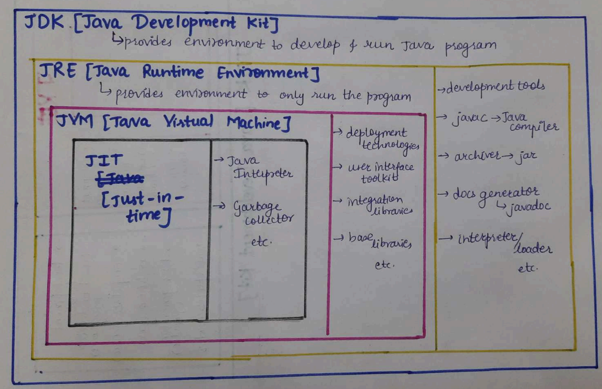

<!-- TOC -->
# INDEX

- [INDEX](#index)
- [Differences between Java and C++](#differences-between-java-and-c)
  - [Unlike C++, Java is NOT pass-by-reference](#unlike-c-java-is-not-pass-by-reference)
  - [C++ has Destructors, Java has Finalization](#c-has-destructors-java-has-finalization)
  - [Multiple Inheritance](#multiple-inheritance)
- [Naming Conventions in Java](#naming-conventions-in-java)
- [How Java code executes](#how-java-code-executes)
- [Platform independence of Java and difference from C++](#platform-independence-of-java-and-difference-from-c)
  - [Byte code vs. Source code](#byte-code-vs-source-code)
- [JDK vs. JRE vs. JVM vs. JIT](#jdk-vs-jre-vs-jvm-vs-jit)
  - [JDK (Java Development Kit)](#jdk-java-development-kit)
    - [More about `javadoc`](#more-about-javadoc)
      - [Where should we put comments for `javadoc`?](#where-should-we-put-comments-for-javadoc)
  - [JRE (Java Runtime Environment)](#jre-java-runtime-environment)
  - [JVM (Java Virtual Machine)](#jvm-java-virtual-machine)
    - [Class Loader Subsystem](#class-loader-subsystem)
      - [Loading](#loading)
      - [Linking](#linking)
      - [Initialization](#initialization)
    - [Execution Engine](#execution-engine)
      - [Java Interpreter](#java-interpreter)
      - [`JIT` (Just-In-Time) compiler](#jit-just-in-time-compiler)
      - [Garbage Collector](#garbage-collector)
    - [Runtime Data Areas](#runtime-data-areas)
- [What is a Specification?](#what-is-a-specification)
- [Basic Java program](#basic-java-program)
  - [Packages in Java](#packages-in-java)
    - [Creating a Package](#creating-a-package)
    - [Dynamically importing classes from packages in Java](#dynamically-importing-classes-from-packages-in-java)
    - [Some in-built packages...](#some-in-built-packages)
      - [`java.lang`](#javalang)
      - [`java.io`](#javaio)
      - [`java.util`](#javautil)
  - [Access Modifiers in Java](#access-modifiers-in-java)
    - [Reference Variable Controls Access](#reference-variable-controls-access)
    - [Upcasting in Java](#upcasting-in-java)
    - [Downcasting in Java (NOT possible directly)](#downcasting-in-java-not-possible-directly)
  - [Classes in Java](#classes-in-java)
    - [`java.lang.Object` class](#javalangobject-class)
    - [Multiple classes in one source file](#multiple-classes-in-one-source-file)
    - [`public class` vs. `class`](#public-class-vs-class)
    - [Creating an Object of a Class](#creating-an-object-of-a-class)
    - [`this` keyword](#this-keyword)
      - [Real usage of the `this()` constructor call (*Constructor Chaining*)](#real-usage-of-the-this-constructor-call-constructor-chaining)
    - [`new` keyword (Request for memory allocation at run-time)](#new-keyword-request-for-memory-allocation-at-run-time)
    - [`super` keyword](#super-keyword)
      - [Real usage of the `super()` constructor call (*Constructor Chaining*)](#real-usage-of-the-super-constructor-call-constructor-chaining)
    - [`final` keyword](#final-keyword)
      - [**`final` variable**](#final-variable)
      - [`final` method](#final-method)
      - [`final` class](#final-class)
    - [Wrapper Classes in Java](#wrapper-classes-in-java)
      - [**Need of Wrapper Classes**](#need-of-wrapper-classes)
    - [`java.util.Random` class (Generating Random Numbers)](#javautilrandom-class-generating-random-numbers)
      - [`nextInt()` method](#nextint-method)
      - [`doubles()`, `ints()` and `longs()`  method](#doubles-ints-and-longs--method)
    - [`java.lang.Math` class](#javalangmath-class)
      - [`Math.random()`](#mathrandom)
      - [Getting a random floating-point number between 2 bounds using `Math`](#getting-a-random-floating-point-number-between-2-bounds-using-math)
      - [Getting a random integer between 2 bounds using `Math`](#getting-a-random-integer-between-2-bounds-using-math)
- [Primitive Data Types in Java](#primitive-data-types-in-java)
  - [`int`](#int)
  - [`byte`](#byte)
  - [`char`](#char)
    - [What is Unicode?](#what-is-unicode)
    - [Difference between ASCII and Unicode](#difference-between-ascii-and-unicode)
- [Non-Primitive data types in Java](#non-primitive-data-types-in-java)
  - [`java.lang.String` (Strings in Java)](#javalangstring-strings-in-java)
    - [Strings support concatenation](#strings-support-concatenation)
  - [`java.lang.Character` (Wrapper class for `char` primitive)](#javalangcharacter-wrapper-class-for-char-primitive)
  - [`java.lang.Double`](#javalangdouble)
    - [Infinity in Java](#infinity-in-java)
  - [Arrays](#arrays)
    - [Declaring, Creating & Initializing an Array of PRIMITIVES](#declaring-creating--initializing-an-array-of-primitives)
    - [Default Initialization Value for `int` arrays](#default-initialization-value-for-int-arrays)
    - [Default Initialization Value for `char` Arrays](#default-initialization-value-for-char-arrays)
    - [Specifying the number of elements in an Array](#specifying-the-number-of-elements-in-an-array)
    - [Creating a copy of an Array](#creating-a-copy-of-an-array)
      - [**Assigning the SAME object to a different reference variable**](#assigning-the-same-object-to-a-different-reference-variable)
      - [**Creating a NEW object using `clone()` NON-STATIC method and assigning it to a different reference variable**](#creating-a-new-object-using-clone-non-static-method-and-assigning-it-to-a-different-reference-variable)
    - [Declaring, Creating & Initializing an Array of NON-Primitives (`Objects`, other `Arrays`, etcetera)](#declaring-creating--initializing-an-array-of-non-primitives-objects-other-arrays-etcetera)
  - [`java.lang.reflect.Array` vs. `java.util.Arrays`](#javalangreflectarray-vs-javautilarrays)
    - [`java.lang.reflect.Array`:](#javalangreflectarray)
    - [`java.util.Arrays`:](#javautilarrays)
      - [Printing an Array `java.util.Arrays.toString(Object[] arr)`](#printing-an-array-javautilarraystostringobject-arr)
      - [Copying a portion of an Array `java.util.Arrays.copyOfRange(Object[] arr, int from, int to)`](#copying-a-portion-of-an-array-javautilarrayscopyofrangeobject-arr-int-from-int-to)
  - [Objects](#objects)
    - [Default Initialization value of Objects or types that are Objects](#default-initialization-value-of-objects-or-types-that-are-objects)
    - [Hashcode of an Object](#hashcode-of-an-object)
    - [Displaying an Object](#displaying-an-object)
    - [Overriding the `toString()` method of global class `Object`](#overriding-the-tostring-method-of-global-class-object)
  - [Streams (`java.util.stream`)](#streams-javautilstream)
    - [Converting Streams to Arrays : `toArray()`](#converting-streams-to-arrays--toarray)
- [Information related to Data-types](#information-related-to-data-types)
  - [Type-casting in Java (Forcing Lossy Conversions)](#type-casting-in-java-forcing-lossy-conversions)
  - [Automatic Type Conversion in Expressions in Java](#automatic-type-conversion-in-expressions-in-java)
  - [Brackets & Operator Precedence](#brackets--operator-precedence)
- [Conditional and Looping Statements](#conditional-and-looping-statements)
  - [if-else statements](#if-else-statements)
  - [`for-each` loop (looping through Array elements)](#for-each-loop-looping-through-array-elements)
  - [switch-case](#switch-case)
- [Taking Input in Java](#taking-input-in-java)
  - [Taking input of `int`](#taking-input-of-int)
  - [Taking input of `String`](#taking-input-of-string)
    - [Taking input of one word](#taking-input-of-one-word)
    - [Taking input of multiple words](#taking-input-of-multiple-words)
  - [Taking input of one character (`char`)](#taking-input-of-one-character-char)
  - [Checking if input stream still has data left](#checking-if-input-stream-still-has-data-left)
  - [Special cases while taking input shown practically](#special-cases-while-taking-input-shown-practically)
- [Functions in Java](#functions-in-java)
  - [Return values](#return-values)
  - [No pass-by-reference](#no-pass-by-reference)
  - [References in Modern Languages](#references-in-modern-languages)
  - [Java NOT having pointers](#java-not-having-pointers)
- [Types of Polymorphism in Java](#types-of-polymorphism-in-java)
  - [Compile-time Polymorphism (Method & Operator Overloading)](#compile-time-polymorphism-method--operator-overloading)
  - [Run-time Polymorphism (Method Overriding)](#run-time-polymorphism-method-overriding)
    - [Dynamic Method Dispatch](#dynamic-method-dispatch)
    - [Overriding Static Methods (NOT POSSIBLE)](#overriding-static-methods-not-possible)
    - [Run-time Polymorphism with Data Members (NOT POSSIBLE)](#run-time-polymorphism-with-data-members-not-possible)
  - [Abstraction in Java](#abstraction-in-java)
    - [Abstract Classes](#abstract-classes)
    - [Interfaces](#interfaces)
- [Important Useful Methods in Java](#important-useful-methods-in-java)
  - [`charAt()` NON-STATIC method for selecting a single character in a string](#charat-non-static-method-for-selecting-a-single-character-in-a-string)
- [TODO](#todo)

<!-- TOC -->


<!-- Application runs directly on computer
Applet runs on browser -->

# Differences between Java and C++

Java is partially modeled on C++, but greatly simplified and improved.

For instance, pointers and multiple inheritance often make programming complicated. Java replaces the multiple inheritance in C++ with a simple language construct called an interface, and eliminates pointers. 

> ***NOTE:*** Although Java doesn't provide the facility of pointer mutation to programmers, it does use pointer internally (in the form of [hashcodes](#hashcode-of-an-object)), as suggested by [this](https://www.javadude.com/articles/passbyvalue.htm) article.

Java uses automatic memory allocation and [garbage collection](#garbage-collector), whereas C++ requires the programmer to allocate memory and collect garbage. 

Also, the number of language constructs is small for such a powerful language. The clean syntax makes Java programs easy to write and read. Some people refer to Java as "C++--" because it is like C++ but with more functionality and fewer negative aspects

## Unlike C++, Java is NOT pass-by-reference

There’s a simple “litmus test” for whether a language supports pass-by-reference semantics:

*Can you write a traditional swap(a,b) method/function in the language?*

A traditional swap method or function takes two arguments and swaps them such that variables passed INTO the function are changed OUTSIDE the function. 

Its basic structure looks like:
```
swap(Type arg1, Type arg2) {
    Type temp = arg1;
    arg1 = arg2;
    arg2 = temp;
}
```

In C++, we could write:

```cpp
void swap(SomeType& arg1, Sometype& arg2) {
    SomeType temp = arg1;
    arg1 = arg2;
    arg2 = temp;
}

...

SomeType var1 = ...; // value "A"
SomeType var2 = ...; // value "B"
swap(var1, var2); // swaps their values!
// now var1 has value "B" and var2 has value "A"
```

But this cannot be done in Java.

## C++ has Destructors, Java has Finalization

- In C++, whenever local objects go out of scope, their destructors are automatically invoked by the compiler when they go out of scope.

  We CANNOT explicitly call the destructor of an object, but we can override the default destructor provided to a class by the compiler, in order to define certain actions that should take place when an object of that class is destroyed.

- In Java, just before destroying any object which is eligible for Garbage Collection, the garbage collector always calls `finalize()` method to perform clean-up activities on that object. 
    
  The `finalize()` method can't be implicitly called.

  This process is known as Finalization in Java.
  
  > ***NOTE:*** Clean-up activity means closing the resources associated with that object like Database Connection, Network Connection, or we can say resource de-allocation. 
  
  Once the `finalize()` method completes, the Garbage Collector immediately destroys that object. 

  The `finalize()` method, which is present in the [`java.lang.Object` class](#javalangobject-class), has an empty implementation. 
  
  We can override this method in user-defined classes to define the clean-up activities required for that particular class, although this is ~~DEPRECATED~~.

  Take a look at this code-snippet:
  ```java
  public class Main {
      public static void main(String args[]) {
          wrapper obj;
          for(int index = 0; index < 1000000; index++) {
              obj = new wrapper();
          }
      }
  }

  class wrapper {
      int num;

      @Override
      protected void finalize() throws Throwable {
          System.out.println("Object destroyed");
      }
  }
  ```

  We know that a reference variable can only point to one object at a time. 
  
  So, in every iteration of the for-loop, we are making the reference variable point to a new object.

  Once too much space gets occupied in the memory by objects that are not in use, the Garbage Collector runs and calls the `finalize()` method of the objects to be deleted.

  The output of the above code-snippet looks something like this:
  ```
  ...
  ...
  Object destroyed
  Object destroyed
  Object destroyed
  Object destroyed
  Object destroyed
  Object destroyed
  Object destroyed
  ...
  ...
  ```

## Multiple Inheritance

Multiple inheritance is the capability of creating a single class with multiple superclasses. 

Unlike C++, java doesn't provide support for multiple inheritance in classes because it makes the rules about function overloads and virtual dispatch decidedly more tricky, as well as the language implementation around object layouts. 

> NOTE: Multiple Inheritance would mean one class would extend one or more classes.

These impact language designers/implementors quite a bit, and raise the already high bar to get a language done, stable and adopted.

See [this](https://github.com/rohan-verma19/learning-C-with-classes#example-code-snippet-example-of-why-multiple-inheritance-is-bad) example for understanding the problem with multiple inheritance.

# Naming Conventions in Java

The below list outlines the standard Java naming conventions for each identifier type:

- [`Classes`](#classes-in-java): Names should be in `PascalCase`. Try to use nouns because a class is normally representing something in the real world:
  ```java
  class Customer 
  class Account 
  ```
  We should also keep the file names of the `.java` files same as the classes.

  For example, the `Main` class should be written in `Main.java`.

- Projects: Every Java program, also referred to as a 'Project' consists of one or more `.java` files, enclosed in a folder. 
  
  
  
  Project names should be in `PascalCase` as well. 
  <!-- In IDEs like NetBeans, we can choose  -->

- `Interfaces`: Names should be in `PascalCase`. They tend to have a name that describes an operation that a class can do:
  ```java
  interface Comparable 
  interface Enumerable 
  ```
  Note that some programmers like to distinguish interfaces by beginning the name with an "I":
  ```java
  interface IComparable 
  interface IEnumerable
  ```
- `Methods`: Names should be in `camelCase`. Use verbs to describe what the method does:
  ```java
  void calculateTax()
  string getSurname() 
  ```
- `Variables`: Names should be in `camelCase`. The names should represent what the value of the variable represents:
  ```java 
  string firstName 
  int orderNumber 
  ```
- `Constants`: Names should be in `UPPER_SNAKE_CASE`.
  ```java
  static final int DEFAULT_WIDTH 
  static final int MAX_HEIGHT
- [`Packages`](#packages-in-java): Names should be in lowercase. With small projects that only have a few packages it's okay to just give them simple (but meaningful!) names:
  ```java
  package pokeranalyzer
  package mycalculator 
  ```
  In software companies and large projects where the packages might be imported into other classes, the names will normally be subdivided. 
  
  Typically this will start with the company domain before being split into layers or features:
  ```java
  package com.mycompany.utilities 
  package org.bobscompany.application.userinterface 
  ```

# How Java code executes


The Java compiler compiles source code contained within a `.java` file into a `.class` file containing byte code, which is some intermediate language of java, that needs a JVM (Java Virtual Machine) to run.

Then, JVM converts the byte code into machine code, by interpreting line-by-line. 

The process by which byte code is formed in known as **compile time**.

The subsequent steps where a JVM is required, is known as **run time**.

# Platform independence of Java and difference from C++

The byte code of Java can run on all operating systems. 

For example, if a piece Java code compiled into byte code on a Windows system. That byte code can be run on a Linux system as well.

This is unlike in C++, where if we use the [`gcc` compiler](https://github.com/rohan-verma19/learning-C#gcc-compiler) on a Linux system to [convert the Source code into an executable file](https://github.com/rohan-verma19/learning-C#source-code-to-executable-file), that executable can be run on another Linux system but not on a Windows system.

For that, the source code would have to be process using re-compiled (note that here, 'compilation' signifies a number of other processes like assembling, linking, etc) on the Windows system to create a Windows executable `.exe` file.

Executable files contain Machine code (0s and 1s), which is essentially a set of instructions for the computer, that depend on the architecture of the computer's CPU as well as its file system. This is why a Windows executable file can't be run on Linux.

Although Java is platform-independent, JVM is platform dependent.

## Byte code vs. Source code

Now, the question may arise that if we still need a JVM to run byte code, why not just keep the Source code of Java in a `.java` file as it is, and just convert that source code into an executable directly, on each different operating system? 

This is because byte code occupies more than 6 times less memory than java source code. A lot of data/visual representation of code that is required for it to be human readable, is cut out when source code is converted to byte code, explaining its reduced size.

# JDK vs. JRE vs. JVM vs. JIT



## JDK (Java Development Kit)

JDK provides an environment to develop and run the Java program. 

It is a package that includes:
- development tools - to provide an environment to develop your program.
- [JRE](#jre-java-runtime-environment) - to execute your program.
- a compiler, `javac` that converts `.java` files (source code) to `.class` files (byte code). This is achieved during the **compile time**.
- archiver - `jar`
- a documentation generator [`javadoc`](#more-about-javadoc)
- interpreter/loader

### More about `javadoc`

`javadoc` is the official way of writing API documentation. 

We must follow a certain syntax and structure for writing comments in `.java` source files. 

The `javadoc` tool which is included in the JDK, parses a source file and generates HTML documentation from it.

#### Where should we put comments for `javadoc`?


## JRE (Java Runtime Environment)

JRE is an installation package that provides environment to only run the program.

It consists of:
- Deployment technologies
- User interface toolkits
- Integration libraries
- Base libraries
- [JVM](#jvm-java-virtual-machine)

In simple words, JRE is JVM along with a collection of extra files.

After we obtain the `.class` file, the processes that take place at runtime are:
- Class loader loads all classes needed to execute the program.
- JVM sends code to Byte code verifier to check the format of the code.

## JVM (Java Virtual Machine)

TODO : Understand java bytecode is evaluated on virtual stack based processor

JVM is a [specification](#what-is-a-specification) that provides a runtime environment in which Java bytecode can be executed. 

JVM (Java Virtual Machine) is an abstract machine. It is called a virtual machine because it doesn't physically exist.

It loads, verifies and executes Java bytecode. It is known as the interpreter or the core of Java programming language because it executes Java programming.

JRE provides whatever files/resources JVM needs.

JVM consists of three main components or subsystems:

### Class Loader Subsystem 

It is responsible for [loading](#loading), [linking](#linking) and initializing a Java class file (i.e., “Java file”), otherwise known as dynamic class loading.

#### Loading

- Byte code class file is read and binary data is generated, in order to create an object of this 'class' in heap.
- JRE libraries that are being used are also loaded into memory.

Both these processes comprise **loading** into memory.

#### Linking 

- `.class` file is verified (for errors or illegal practices).
- Memory is allocated for class variable and default values.
- Symbolic references are replaced with direct references (**linking** takes place).

#### Initialization

All static variables (variables that have only one value for a particular class, instead of a different value for each instance of said class) are assigned with their values and defined in the code & stack block.
  

### Execution Engine

Contains an interpreter, compiler and garbage collector

#### Java Interpreter

It reads the byte code and interprets (convert line-by-line) into the machine code and executes them in a sequential manner. 

The problem with the interpreter is that it interprets every time, even the same method multiple times, which reduces the performance of the system. 

#### `JIT` (Just-In-Time) compiler

- JIT compiler counterbalances the interpreter’s disadvantage of slow execution and improves the performance.
- It aids in improving the performance of Java programs by compiling bytecode into native machine code at run time.
- It is ENABLED throughout, while it gets ACTIVATED when a method is invoked. For a compiled method, the JVM directly calls the compiled code, instead of interpreting it.
- Since the compilation takes place in run time, a JIT compiler has access to **dynamic runtime information**, enabling it to make better optimizations (such as inlining functions).

#### Garbage Collector

This is a program in java that manages the memory automatically. 

It is a daemon thread which always runs in the background. 

This basically frees up the heap memory by destroying objects that have no reference variables pointing to them or objects which have been corrupted due to overwriting.

### Runtime Data Areas

Contain method areas, PC registers, stack areas and threads.


# What is a Specification?

Specification means you describe how something should work, not what one has to do in order to let it work (which is the implementation).

As mentioned in the preface to the Java SE 8 Edition by Oracle:

**... An implementation of the Java Virtual Machine must embody this specification, but is constrained by it only where absolutely necessary.**

This meant that Oracle SPECIFIED how a JVM should work and left the implementation to the organization building the JVM.

This explanation of what a specification is, is universal in the domain of computing.

# Basic Java program

```java
1 package examplepackage;
2
3 public class Main {
4   public static void main(String[] args) {
5     System.out.println("Hello World");
6   };
7 };
```
 Now, at first glance this may look like a lot of code for just printing `Hello World`. But lets look at the lines one by one.

- The reasoning for the first line is given under [Packages in Java](#packages-in-java). 

  In simple words, it is for including the contents of our program under the namespace of a particular package.

- The access modifiers used can be read about [below](#access-modifiers-in-java).

- By default, JVM invokes the `main()` method of `public` class within a `.java` file. JVM always looks for the `main()` method with a `String` type Array as a parameter.

- The reasoning for keeping the `main()` method as `static` is quite practical.

  If a method or data member is `static`, that data member/method can be called directly using class name without creating an instance of the class. Note that `static` members can be accessed using instances AS WELL.
 
  So, JVM need NOT instantiate the class `Main` and can directly call the method.
  
- `String[] args` is the syntax for declaring an array in Java. 

  It is kept as an argument for the `main()` method for taking the input of arguments of the type `String` when running the executable of the source file as shown:
  ```console
  java ClassName argumentOne argumentTwo argumentThree
  ```

  Indices along with the array name can be used for accessing the arguments we give as shown:
  ```java
  System.out.println(args[0]);
  System.out.println(args[1]);
  ```
  Since the `main()` method is the entry point of the Java program, whenever we execute a class file, the JVM searches for a `main()` method, which is `public`, `static`, with return type `void`, and a `String` array as an argument. If anything is missing the JVM raises an error.
  
## Packages in Java

Packages are used in Java in order to prevent naming conflicts, to control access, to make searching/locating and usage of classes, interfaces, enumerations and annotations easier, etc.

### Creating a Package

While creating a package, we  should choose a name for the package and include a `package` statement along with that name at the top of every source file that contains the classes, interfaces, enumerations, and annotation types that you want to include in the package.

it should look like this: 
```java
package packagename
```
with the name of the package in lowercase.

### Dynamically importing classes from packages in Java

We can dynamically import classes from Java's in-built pre-existing packages using the universal selector `*`.

```java
import java.util.*;
```
Only the classes we use from the `util` package will be imported.

There is no performance difference if we just import the a specific class like `Scanner` or use the universal selector.

### Some in-built packages...

#### `java.lang` 

Bundles the fundamental classes such as: `System`, `String`, etc.

It is included by default, which is why we need not explicitly include it everytime we need to use a class in this package.

#### `java.io` 

Contains classes for input, output functions are bundled in this package.

#### `java.util` 

It contains the collections framework, legacy collection classes, event model, date and time facilities, internationalization, and miscellaneous utility classes (a string tokenizer, a random-number generator, and a bit array).

## Access Modifiers in Java

The access modifiers in Java are somewhat similar to those in C++.

- `Private`: The access level of a private modifier is only within the class. It cannot be accessed from outside the class.

- `Default`: The access level of a default modifier is only within the package. It cannot be accessed from outside the package. If you do not specify any access level, it will be the default.

- `Protected`: The access level of a protected modifier is anywhere within the package or from inside sub-classes in different packages.
  
  The methods or data members declared as protected are accessible within the same package or subclasses in different packages.

  If you do not make a sub-class inside another package, it cannot be accessed from outside the package.

- `Public`: The access level of a public modifier is everywhere. It can be accessed from within the class, outside the class, within the package and outside the package.

    This has the widest scope amongst all access modifiers.

    >NOTE: There can be only one public class in a single java file. 
    >
    > Let's take an example to understand this. A and B are public classes defined in the same file, and the file name say `A.java`.
    >
    > When we compile this file and compiler wants to create `.class` file then compiler gets confused to decide which name to take while creating `.class` file since both are public and public modifier has highest precedence among all modifiers, so in this case it creates ambiguity. 
    >
    > So, in order to avoid this kind of scenario Java specification does not allow 2 public classes in a single file.

### Reference Variable Controls Access

The members and methods we can access are determined by the type of our ***reference variable***.

Suppose we have a class `Base` and a class `Sub` that derives from it. 

- `Base` has a member `baseMember`. 
- `Sub` has an additional member `subMember`.

```java
Base baseRefVar = new Sub();
system.out.println(baseRefVar.subMember); //error
```

In the above case, even though we have assigned an object of the class `Sub` to the reference variable, we CANNOT access the data-members of `Sub` using this reference variable, since it is of type `Base`.

---

### Upcasting in Java

Upcasting is a type of object typecasting in which a child object is typecasted to a parent class object. 

- By using Upcasting, we can easily access the variables and methods of the parent class to the child class. 
- Here, we don't access all the variables and methods. We access only some specified variables and methods of the child class. 
- Upcasting is also known as ***Generalization*** and ***Widening***.
- It is said to be a technique in which a superclass reference variable refers to the object of the subclass.

Let us try to understand this with an example.

Suppose we have a class `Base` and a class `Sub` that derives from it. 

- `Base` has a member `baseMember`. 
- `Sub` has an additional member `subMember`.

As shown in the example under the previous heading, we can assign the object of a class to the reference variable of its ***superclass***.

> NOTE: This can be done because the constructor of the class implicitly calls the constructor of its ***superclass***.

### Downcasting in Java (NOT possible directly)

Downcasting is another type of object typecasting. 

In Downcasting, we assign a parent class reference object to the child class. 

In Java, we cannot assign a parent class reference object to the child class, but if we perform downcasting, we will not get any compile-time error. 

However, when we run it, it throws the `ClassCastException`. 

```java
Sub subRefVar = new Base(); // run-time error
```

Thinking logically, we cannot do this because the constructor of a particular class CANNOT call the constructor of its sub-class, because it doesn't have access to it.

So, the data-members belonging to `Base` would remain unitialized.

Now the point is if downcasting is not possible in Java, then why is it allowed by the compiler? In Java, some scenarios allow us to perform downcasting. Here, the subclass object is referred by the parent class.

Read about them [here](https://www.javatpoint.com/upcasting-and-downcasting-in-java).

---

## Classes in Java

In Java, as in other object-oriented programming languages, classes can be derived from other classes. 

- The derived class (the class that is derived from another class) is called a ***subclass***. 
- The class from which its derived is called the ***superclass***. 
 
In fact, in Java, all classes must be derived from some class. 

> **NOTE:** If a class doesn't have a parent defined *explicitly*, [`java.lang.Object`](#javalangobject-class) class is implicitly defined as its superclass.

### `java.lang.Object` class

Here, `java` is the root package, `lang` is the sub-package and `Object` is the .java `file`/`class`.

The class `Object` is the root of the class hierarchy. Every class has `Object` as a superclass. 

All objects, including arrays, implement the methods of this class.

If a class does not extend any other class then it is a direct child class of `Object` and if extends another class then it is indirectly derived. 

### Multiple classes in one source file

If a single source file contains multiple Classes, all of the classes have separate class files. 


In most IDEs, only the `.class` file of the public class would be displayed. 

Navigating to the folder where that `.class` file is present using the terminal or file manager would lead to the discovery of the other `.class` files as well.

### `public class` vs. `class`

A class NOT explicitly declared as `public` is only available to other classes in its package, without having to import it.

A class declared as `public` has the above characteristics along with the ability to be imported for use from anywhere.

### Creating an Object of a Class

- In C++, creating an object was simple as we just had to specify the class type followed by the name of the object to be created and parentheses, either containing no arguments (Default Constructor) or a specific number of arguments (Parameterized Constructor).
  ```cpp
  class className {
    // Body
  };
  className objectName();
  ```

- In Java, it is somewhat similar where we specify the class name, followed by the object name and then we use the assignment operator (`=`) along with the constructor of the class.
  ```java
  ClassName {
    // Body
  }
  
  ClassName ObjectName = new ClassName();
  ```

### `this` keyword

In java, `this` is a reference variable that points to the current object. It can be used for a variety of purposes (for an exhaustive list, refer [this](https://www.javatpoint.com/this-keyword) tutorial from javatpoint):

- To refer to the current class instance variable (like in CPP).
- To invoke the current class method.

  We can invoke the method of the current class by using the `this` keyword. 
  
  If we don't use the `this` keyword, the compiler automatically adds `this` keyword while invoking the method.
  
  Code written by us:
  ```java
  class A {
    void m(){}

    void n {
      m();
    }
  }
  ```

  The compiler converts the above code to the following:
  ```java
  class A {
    void m(){}

    void n {
      this.m(); // 'this' keyword implicitly added
    }
  }
  ```
  
  - The `this()` constructor call can be used to invoke the current class constructor. It is used to reuse the constructor. In other words, it is used for ***constructor chaining***.

    Calling default constructor from parameterized constructor:
    ```java
    class A {  
      A() {
        System.out.println("hello a");
      }  
      A(int x) {  
        this(); // Calling the default constructor defined above.
        System.out.println(x);  
      }  
    }  

    class Main {  
      public static void main(String args[]){  
        A a = new A(10);  
      }
    }  
    ```

    Output:
    ```
    hello a
    10
    ```

#### Real usage of the `this()` constructor call (*Constructor Chaining*)

The `this()` constructor call should be used to reuse another constructor from the constructor. 
  
It maintains the chain between the constructors i.e. it is used for ***constructor chaining***. 

Let's see the example given below that displays the actual use of this keyword.

```java
class Student {

  int rollno;  
  String name,course;  
  float fee;  
  
  Student(int rollno,String name,String course) {  
    this.rollno = rollno;  
    this.name = name;  
    this.course = course;  
  }  
  
  Student(int rollno,String name,String course,float fee) {  
    // reusing the above constructor
    this(rollno, name, course);
    this.fee = fee;  
  }  
}  
```

> NOTE: Call to `this()` must be the first statement in constructor.
>
> Otherwise, we would get the following error:
> ```
> Compile Time Error: Call to this must be first statement in constructor
> ```

---

### `new` keyword (Request for memory allocation at run-time)

The `new` keyword makes a request for memory allocation in heap, during run-time.

We don't need to use the `new` keyword with primitive data types because, in java, they are not implemented as objects and are stored in the stack memory only.

Uses of `new` keyword:

- For Non-Primitive types, which are implemented as objects.
- For Objects instantiated from [Wrapper Classes](#wrapper-classes-in-java) of Java (~~DEPRECATED~~). 
  ```java
  Integer intWrapper = new Integer(10);
  ```
  But this is now ~~DEPRECATED~~ and the following syntax is to be used:
  ```java
  Integer intWrapper = 10;
  ```

---

### `super` keyword

The super keyword in Java is used in subclasses to access superclass members (attributes, constructors and methods).

- `super` can be used to refer ***immediate*** parent class instance variable.
- `super` can be used to invoke ***immediate*** parent class method.
- `super()` can be used to invoke ***immediate*** parent class constructor, also referred to as ***Constructor Chaining***.

#### Real usage of the `super()` constructor call (*Constructor Chaining*)

```java
// 2-D Object
class TwoDimObject {
    double length;
    double breadth;

    TwoDimObject() {
        length = -1;
        breadth = -1;
    }

    TwoDimObject(double side) {
        length = side;
        breadth = side;
    }

    TwoDimObject(double length, double breadth) {
        this.length = length;
        this.breadth = breadth;
    }

    TwoDimObject(TwoDimObject other2D) {
        this.length = other2D.length;
        this.breadth = other2D.breadth;
    }
}

// 3-D Object has the properties of a 2-D Object
class ThreeDimObject extends TwoDimObject {
    double height;

    ThreeDimObject() {
        super();
        height = -1;
    }

    ThreeDimObject(double length, double breadth, double height) {
        super(length, breadth);
        this.height = height;
    }

    ThreeDimObject(ThreeDimObject other) {
        super(other);
        // This is technically equivalent to (TwoDimObject other2D = other;)
        // We can do this since reference variable of a class can point to object of its sub-class.
        this.height = other.height;
    }
}
```

---

### `final` keyword

The `final` keyword in Java, has 3 purposes:
- Stop Value Change, using [`final` variables](#final-variable)
- Stop Method Overriding
- Stop Inheritance

#### **`final` variable**

If you make any variable as `final`, you cannot change its value (It will be constant.

A final variable that is not initialized at the time of declaration is known as ***blank final variable***.

`final` variables can also be kept as data-members of classes, in which case, they can be initialized only in constructor.

`final` variable ARE inherited.

```java
class Bike {  
  final int speedlimit; //blank final variable  
    
  Bike() {  
    speedlimit = 70; // initialized in constructor
    system.out.println(speedlimit);  
  }  
  
  public static void main(String args[]) {  
    new Bike();  
  }  
}  
```

> ***NOTE:*** If a [non-primitive](#non-primitive-data-types-in-java) variable is kept as final, the [hashcode](#hashcode-of-an-object) stored in it will stay constant, but the value of the variable, stored in the heap may be changed.

#### `final` method

A method declared as `final` cannot be overridden.

But `final` methods are inherited by subclasses.

This gives a performance enhancement since the java compiler can straightaway inline the calls to `final` methods because it knows that these methods can't be overridden.

So, ***early binding*** takes place over here, as opposed to methods that are overridden, which have ***late binding***.

#### `final` class

A class declared as `final` CANNOT be used to derive sub-classes.

Also, all the methods of `final` classes are implicitly declared as `final`.

---

### Wrapper Classes in Java

A Wrapper class is a class whose object wraps or contains primitive data types. 

When we create an object of a wrapper class, it contains a field and in this field, we can store primitive data types. 

In other words, we can wrap a primitive value using a wrapper class object built for that specific primitive data type.

> ***NOTE:*** All primitive wrapper classes (`Integer`, `Byte`, `Long`, `Float`, `Double`, `Character`, `Boolean` and `Short`) are **IMMUTABLE**, because they are [`final`](#final-keyword) classes. 
>
> They replicate the behaviour of primitives. 
> 
> - So, operations like addition and subtraction create a new object and not modify the old.
>
> - Even when passing objects of wrapper classes as arguments to functions, you need to return the latest value back to see the changes.

#### **Need of Wrapper Classes**

- They convert primitive data types into objects.   
  
  Objects are needed if we wish to modify the arguments passed into a method. This is because primitive types are passed by value in Java.

- The classes in `java.util` package handles only objects and hence wrapper classes help in this case also.

---

### `java.util.Random` class (Generating Random Numbers)

```java
Random randomObject = new Random();
```
#### `nextInt()` method

This method gives ANY random integer.

```java
System.out.println(randomObject.nextInt()); 
```

We can limit the upper bound of the range for selecting the random integer like so:

```java
System.out.println(randomObject.nextInt(20));
```

This gives a random integer from 0 upto but not including 20.

#### `doubles()`, `ints()` and `longs()`  method

These method return [Streams](#streams-javautilstream) of different data-types.

```java
int[] integer = randomObject.ints(2, 56, 74).toArray();
double[] integer = randomObject.doubles(2, 2.5, 7.0).toArray();
long[] integer = randomObject.longs(2, 3123156, 4566474).toArray();
```

- The first parameter gives the stream size
- The second one the start of the range
- The third one the upper bound

The [`toArray()`](#converting-streams-to-arrays--toarray) method converts the `IntStream`, `LongStream`, `DoubleStream` to arrays.

### `java.lang.Math` class

Note that `java.lang` package is imported by-default. 


- `ceil` : x is rounded up to its nearest integer. This integer is returned as a double value.
  ```java
  System.out.println(Math.ceil(7.5));
  ```
- `floor` :  x is rounded down to its nearest integer. This integer is returned as a double value.
  ```java
  System.out.println(Math.floor(7.5));
  ```
- `PI` : Gives us the value for Pi.
  ```java
  System.out.println(Math.PI);
  ```

#### `Math.random()`

The `java.lang.Math.random()` method returns a pseudorandom double type number greater than or equal to 0.0 and less than 1.0 

#### Getting a random floating-point number between 2 bounds using `Math`

```java
int a = 10;
int b = 10;
double randomFloat =  a + Math.random() * b;
```
This gives us ANY random number between 10 (a) and 20 (a+b), excluding 20 (a+b).

#### Getting a random integer between 2 bounds using `Math`

```java
int randomInt = Math.ceil(Math.random() * 20);
```

As we know `Math.random()` gives a random floating-point number between 0 and 1, excluding 1. Multiplying that by 20 increases that range to 0-20. excluding 20.

`Math.ceil()` rounds numbers upto the nearest integer. So numbers from 0-19.99... will be rounded up to the nearest integer, effectively taking our random range from 0-20 (only integers).


# Primitive Data Types in Java

## `int`

For improved readability, we can add underscores to represent commas in larger integer values. The underscores can be placed as required since there is no format for these.`
```java
int integer1 = 234_000_000;
int integer2 = 2_3__4
```

## `byte`

byte datatype can store values from -128 to 127.

If we try to store a value out of that string, for example 128, we will get a warning about "possible lossy conversion" unless we [typecast](#typecasting-in-java) it.

If we try to perform the following type casting:
```java
byte byteValue = (byte)(128);
byte byteValue = (byte)(129);
byte byteValue = (byte)(130);
```
It will start from the bottom of the range of the byte data type, which is `-128`, then `-127`, then `-126` etc.

## `char`

`char` is a primitive type that represents a single 16 bit [Unicode](#what-is-unicode) character.

Although using [ASCII](#difference-between-ascii-and-unicode) logic works in same cases like:
```java
int integer = 65; // This is 41 in hexadecimal.
char character = (char)(integer);
System.out.println(character);
```

Output:
```
A
```

But, internally Java uses [Unicode](#what-is-unicode), which uses hexadecimal numbers to represent characters. 

So, `A` would be written as `\u0041` in [Unicode](#what-is-unicode), where `\u` is the Escape Sequence for [Unicode](#what-is-unicode).

### What is Unicode?

Unicode is an encoding for textual characters which is able to represent characters from many different languages from around the world.

### Difference between ASCII and Unicode

The main difference between ASCII and Unicode is that: 
- ASCII represents lowercase letters (a-z), uppercase letters (A-Z), digits (0-9) and symbols such as punctuation marks. 
  
  It supports only 128 characters and uses 7 bits to represent a character.
- Unicode represents letters of English, Arabic, Greek etc., mathematical symbols, historical scripts, and emoji covering a wide range of characters than ASCII.
  
  It uses 8, 16 or 32 bits to represent a character depending on the encoding type.

# Non-Primitive data types in Java

Non-primitive types are created by the programmer and is not defined by Java (except for String). 

Non-primitive types can be used to call methods to perform certain operations, while primitive types cannot. 

A primitive type always has a value, while non-primitive types can be **null**.

## `java.lang.String` (Strings in Java)

In java, strings are also Objects (read the information on [Objects](#objects) below for better understanding), meaning they have a reference variable stored in stack and the actual `String` object is stored in heap.

Also here, strings are immutable, which saves memory. 

When another reference variable is assigned the same string value during the same runtime, it will point to the same string object, which can be seen below.

This is verified by doing equality comparison between the [hashcodes](#hashcode-of-an-object) of the strings below.

> ***NOTE:*** As mentioned below, under [Hashcode of an Object](#hashcode-of-an-object), `Object`s are uniquely identified by hashcodes, pointed to by their reference variables. 
> 
> Two reference variables point to the same object only when they store the same hashcodes.

```java
String str1 = "hello";
String str2 = "hello";
String str3 = new String("hello");
if(str1 == str2) {
    System.out.println("foo");
}
if (str2 != str3) {
    System.out.println("bar");
}
```

Output:
```
foo
bar
```

`str1` and `str2` store the same hashcodes, but `str3` is a different object (having a different hashcode) which is why the inequality check operation between `str2` and `str3` returns true.

### Strings support concatenation

```java
public static void main(String[] args) {
        String a = "hello"
        String b = "";
        b += a.charAt(0);
        System.out.println(b);
    }
```

The output of this is:
```
h
```

## `java.lang.Character` (Wrapper class for `char` primitive)

`Character` is a [wrapper class](#wrapper-classes-in-java) that allows us to use [`char`](#char) primitive concept in OOP.

It has some built-in methods that the `char` primitive data type doesn't have. 

Example is given below.

```java
Character charInstance = 'a'; 
System.out.println(Character.isDigit(charInstance));
```

This method returns a boolean value depending on whether the given character is a digit or not.

## `java.lang.Double`

`Double` is a [wrapper class](#wrapper-classes-in-java) for the primitive type **double** which contains several methods to effectively deal with a double value like converting it to a string representation, and vice-versa.

### Infinity in Java

The Double class in Java supports infinity. You can implement positive infinity or negative infinity.

The syntax for it is the following:
```java
double posInf = Double.POSITIVE_INFINITY;
double negInf = Double.NEGATIVE_INFINITY;
```

## Arrays

We can create an array in Java using the following syntax:
```java
dataType[size] arrayName;
```
- `dataType` - it can be primitive data types like `int`, `char`, `double`, `byte`, etc. or Java objects.
- `size` - We need to specify a size for the array when if we are just declaring the array.

  In the case where we declare and initialize the array at the same time, we should NOT specify a size for the array. For example
- `arrayName` - it is an identifier

### Declaring, Creating & Initializing an Array of PRIMITIVES

- DECLARING the Array reference variable.

  ```java
  int[] intArray; 
  ```

- CREATING the array OBJECT and assigning it to the reference variable `intArray`. All elements are [initialized](#default-initialization-value-for-int-arrays) with value `0`.

  ```java
  intArray = new int[5] // `int[5]` is the entire array OBJECT
  ```

  Notice how the format for object creation is similar to other classes like `Scanner` and `Random` in Java.

- ASSIGNING values to the array indices.

  ```java
  for(int index = 0; index < 2; index++) { 
      intArray[index] = (int)(Math.random() * 100);
  }
  ```

### Default Initialization Value for `int` arrays

If suppose we create a reference variable which is an array of integers (`int`) and then we assign an object to it in the following manner:

```java
int[] intArray;
intArray = new int[3];
```

And then we try to print the array using:

```java
System.out.println(Arrays.toString(intArray));
```

We will be shown an array of `O`s.

### Default Initialization Value for `char` Arrays

If suppose we create a reference variable which is an array of characters and then we assign an object to it in the following manner:

```java
char[] charArray;
charArray = new char[3];
```

And then we try to print the array using:

```java
System.out.println(Arrays.toString(charArray));
```

We will be shown an array of unknown characters, each of which will have a value of `\u0000`, which is the **null** character in [Unicode](#what-is-unicode).

### Specifying the number of elements in an Array

In order to define the number of elements that an array can hold, we have to allocate memory for the array in Java. For example,
```java
// declare an array
double[] data;

// allocate memory
data = new double[10];
```

Or instead of explicitly allocating memory for an array, we can also assign the array a value.
```java
double[] data = {1, 2, 3, 4};
```

### Creating a copy of an Array

#### **Assigning the SAME object to a different reference variable**

```java
int[] arr1 = {1, 2, 3, 4, 5};
int[] arr2 = arr1;
arr2[0] = 23;
System.out.println(arr1[0]);
```

The output of this code snippet is 23.

This is because here, we are creating another reference variable `arr2` and making it point to the same object as `arr1`.

So, when we change the object using `arr2`, it gets changed for both reference variables.


#### **Creating a NEW object using `clone()` NON-STATIC method and assigning it to a different reference variable**

```java
int[] arr1 = {1, 2, 3, 4, 5};
int[] arr2 = arr1.clone();
arr2[0] = 23;
System.out.println(arr1[0]);
```
The output of this code snippet is 1.

This is because here, we are using the `clone()` of `Array` class to create a duplicate object, and assigning it to the reference variable `arr2`.

So now, the changes we make to `arr2` are independent of the `arr1`.

---

### Declaring, Creating & Initializing an Array of NON-Primitives (`Objects`, other `Arrays`, etcetera)

Suppose we have a user-defined class `Student`.

- DECLARING the Array reference variable.

  ```java
  Student[] studentArray; 
  ```

- CREATING the array OBJECT and assigning it to the reference variable `intArray`. All elements are [initialized](#default-initialization-value-for-int-arrays) with value `0`.

  ```java
  studentArray = new Student[5]
  // `Student[5]` is the entire array OBJECT, 
  // where it signifies that it is an array of 5 `Student` reference variables.
  ```

  > ***Note***: This array OBJECT (`Student[5]`) contains a reference variable at its each index position, which can point to objects of `Student` class. 
  >
  > THESE reference variables don't point to any objects YET. 
  >
  > For that, we need to invoke constructors of any type, of the `Student` class, and individually assign these created objects to the reference variable at each index position of the created array OBJECT.

- Making the reference variables of the Array OBJECT to point to `Student` objects.

  ```java
  for(int index = 0; index < 5; index++) { 
      studentArray[index] = new Student(); 
      // Default constructor used.
  }
  ```

- After this, we can use some kind of ***user-defined*** member function (for example, `setData()` which asks for input from the user for the member values) to assign values to members of each of the objects.

  ```java
  for(int index = 0; index < 5; index++) { 
      studentArray[index].setData();
  }
  ```

---

## `java.lang.reflect.Array` vs. `java.util.Arrays` 

They simply serve different purposes with a different set of methods:

---

### `java.lang.reflect.Array`:
 
The Array class provides static methods to dynamically create and access Java arrays.

This class is essentially a utility class with static methods to manipulate arrays on a lower level. It is usually used for advanced techniques where access to arrays is required through the reflection API.

---

### `java.util.Arrays`:
 
This class contains various methods for manipulating arrays (such as sorting and searching). This class also contains a static factory that allows arrays to be viewed as lists.

This class is essentially a utility class with static methods to work on raw arrays and to provide a bridge from raw arrays to Collection based arrays (List).

#### Printing an Array `java.util.Arrays.toString(Object[] arr)`

This STATIC method returns a string representation of the contents of the specified `Object`/primitive array. 

If the array contains other arrays as elements, the array is displayed with the [hashcodes](#hashcode-of-an-object) of the nested arrays as elements.

```java
int[] arr = {1, 2, 3};
System.out.println(Arrays.toString(arr))
```

We use the `toString` method of `Array` class to convert the array into a `String` to print an array because `prinln` method doesn't take arrays as arguments.

#### Copying a portion of an Array `java.util.Arrays.copyOfRange(Object[] arr, int from, int to)`

This STATIC method copies the specified range of the specified array into a new array.

The parameters of this method are:
- Original array (`Object[] arr`) from which a range is to be copied
- Initial index (`int from`) of the range to be copied
- Final index (`int to`) of the range to be copied, **EXCLUSIVE**.

---

## Objects

Go through [Classes in Java](#classes-in-java) and
the [`java.lang.Object` class](#javalangobject-class) explained above before reading this.

Objects in Java are stored in Heap memory, and they exist throughout the entire run-time of the program.

Even if its reference variable is made to point to a different Object, the Object will stay in memory. 

### Default Initialization value of Objects or types that are Objects

Objects, Arrays, Strings in Java have the value `null` when they are uninitialized.

### Hashcode of an Object

Upon the creation of a new object, the java compiler gives it a unique code known as a **Hashcode**.

It is a numeric representation of an object's contents so as to provide an alternate mechanism to loosely identify it.

> ***NOTE:*** The object's values are not represented by the hashcode, only the storage location is.
> 
> What that means is when the values of the object's data members are changed, the hashcode remains the same.

### Displaying an Object

If suppose `bar` is a reference variable pointing to an object of an arbitrary class `foo`, and we pass `bar` as a parameter to `System.out.println()`, we would get the [hashcode](#hashcode-of-an-object) of the object pointed to by `bar` as output.

> NOTE: This is because `System.out.println()` implicitly calls the `toString()` method. 
> 
> The default `toString()` method in Object prints `class name @ hash code`. 
> 
> We can [override the `toString()` method]() in a user-defined class to print proper output.

```java
foo bar = new foo();

System.out.println(bar);
```

Output would look something like:
```
<package-name>.<sub-package-name>.bar@2f92e0f4
```

### Overriding the `toString()` method of global class `Object`

The `toString()` method of the global class [`Object`](#javalangobject-class), inherited by all classes, looks like this:

```java
public String toString() {
  return getClass().getName() + "@" + Integer.toHexString(hashCode());
}
```

If we were to override this in a subclass, without changing its behavior, it would look like this:

```java
@Override
public String toString() {
  return super.toString(); 
}
```

Take a look at the following code-snippet, in which we have overridden the `toString()` method to print the details of the `Student` class.

```java
class Student {
    String name;
    int age;
    double height;

    Student() {
        this.name = "";
        this.age = -1;
        this.height = -1;
    }

    Student(String name, int age, double height) {
        this.name = name;
        this.age = age;
        this.height = height;
    }

    @Override
    public String toString() {
        return ("Name of student : " + name + "\nAge of student : " + age + "\nHeight of student : " + height + "\n");
    }
}
```

---

## Streams (`java.util.stream`)

A stream is a sequence of objects that supports various methods which can be pipelined to produce the desired result.

The features of Java stream are –

- A stream is not a data structure instead it takes input from the Collections, Arrays or I/O channels.
- Streams don’t change the original data structure, they only provide the result as per the pipelined methods.
- Each intermediate operation is lazily executed and returns a stream as a result, hence various intermediate operations can be pipelined. Terminal operations mark the end of the stream and return the result.

### Converting Streams to Arrays : `toArray()`

`Stream` provides `toArray()` method that returns an array containing the elements of the stream in the form of Object array.

Syntax:
```java

int[] integer = randomObject.ints(2, 56, 74).toArray();

```

The [`ints()`](#doubles-ints-and-longs--method) method returns an `IntStream` containing a stream of random integers, depending upon the arguments provided to [`ints()`](#doubles-ints-and-longs--method).

# Information related to Data-types

## Type-casting in Java (Forcing Lossy Conversions)

Java is quite persistent with warnings regarding "possible lossy conversions" in the case of IMPLICIT type conversion. 

In order to force conversions that might be lossy, we can use EXPLICIT type conversion or Type Casting.

Note that some conversions are not possible even using typecasting, such as `int` to `boolean`.

See [TypeCasting.java](JavaProjects/MasterProject/src/com/rohan/TypeCasting.java) for examples.

## Automatic Type Conversion in Expressions in Java

While evaluating expressions, the intermediate value may exceed the range of operands and hence the expression value will be promoted. Some conditions for type promotion are:
- Java automatically promotes each `byte`, `short` or `char` to `int` when evaluating an expression. 
  
  This is the bare minimum since it is possible that the multiplication of two bytes is out of the range of `byte` datatype.   

  Note that for division, there is no automatic type conversion to a floating point value if no operand is a floating point number. This will result in truncation of values after the decimal. 
- If one operand is `long`, `float` or `double`, the whole expression is promoted to `long`, `float` or `double` respectively.

Let us take a short example to understand **this**:
```java
byte a = 40;
byte b = 50;
double c = 10.0 + a / b; 
```
Here, each `byte` is automatically promoted to `int` during the evaluation of this expression. 

If we had tried a similar operation in C/CPP, we would have to type-cast each value into an `int` before performing the operation.

## Brackets & Operator Precedence

It is import to understand that brackets and operator precedence also matter in expression evaluation. 

If suppose we have 2 expressions with datatypes like this:
```java
1 float + int / int
2 float + (int + int)
```
- In the first operation, since the precedence of division is higher, `int`/`int` will be performed before the upgradation to `float` so some part of the result of the division operation may be lost.
- In the second operation, even though the precedence of operators is same, brackets are around the two `int` values so they will be added without upgradation to `float`.

# Conditional and Looping Statements

## if-else statements

`int` to `boolean` type conversion is not possible in Java.
So, we can't use the following syntax:
```java
if(1) {
  //...
}
else {
  //...
}
```

## `for-each` loop (looping through Array elements)

This is also known as an enhanced for loop.

The syntax of the Java for-each loop is:
```java
for(dataType item : array) {
    ...
}
```
Here,

- `dataType` - the data type of the array/collection
- `item` - each item of array/collection is assigned to this variable
- `array` - an array or a collection

## switch-case

Switch statements in Java can take case values in numerical values (`byte`, `short`, `int` etc, where `char` datatype comes under `int` as well) and `String` as well.
    
It also has a `default` case for an invalid input.
    
The datatype of the input of the switch expression and the cases should be same.

Example of a switch-case statement:
```java
public static void main(String[] args) {
    String month = "jan";
    
    switch(month) {
        case "jan":
            System.out.println("This is January");
            break;
        case "feb":
            System.out.println("This is February");
            break;
        case "mar":
            System.out.println("This is March");
            break;
        default:
            System.out.println("No valid month string");
            break;
    }
}
```

# Taking Input in Java

We can make use of the `Scanner` class present in the `java.util` package.

The `Scanner` class reads an entire line and divides the line into tokens. **Tokens** are small elements that have some meaning to the Java compiler. 

For example, Suppose there is an input string: How are you.
In this case, the scanner object will read the entire line and divides the string into tokens: `“How”`, `“are”` and `“you”`. 

The object then iterates over each token and reads each token using its different methods.

Note that taking input using a method of the `Scanner` class automatically adds a new line after getting the input.

Since these methods aren't `static`, we need to create an object of the `Scanner` class in order to use them. 
```java
import java.util.Scanner;

public class Main {
    public static void main(String[] args) {
      Scanner scannerObject = new Scanner(System.in);
    }
}
```
The method we used here to create the object `scannerObject` can be read about [above](#creating-an-object-of-a-class).

In a sense, we are creating an object the class `Scanner` and passing the `System.in` stream to it for scanning/reading input. 

So when we use methods on the created object, it will take a look at the standard input stream.

We may pass an object of class `File` if we want to read input from a file.

## Taking input of `int`

```java
int integer = scannerObject.nextInt();
```
The `java.util.Scanner.nextInt()` method is used to scan the next token of the input as an `int`.

## Taking input of `String`

### Taking input of one word

```java
String oneWord = scannerObject.next();
```
The `java.util.Scanner.next()` method finds and returns the next complete token from the current scanner. 

A complete token is preceded and followed by input that matches the delimiter pattern.

### Taking input of multiple words

```java
String multiWord = scannerObject.nextLine();
```
The `java.util.Scanner.nextLine()` method scans from the current position until it finds a line separator delimiter (for example, `\n`). 

The method returns the String from the current position to the end of the line.

## Taking input of one character (`char`)
```java
char character = scannerObject.next().charAt(0);
```

This helps us take input of a character as:
- next() takes the next word.
- charAt() is a method the String class present in `java.lang.String`. It takes the character at a specific index of a string.

## Checking if input stream still has data left

```java
Scanner scannerObject = new Scanner(System.in);
scannerObject.hasNext(); 
```
This returns a boolean value of true if this scanner has more data to be read.

## [Special cases while taking input shown practically](./JavaProjects/MasterProject/src/com/basics/TakingInput.java)

# Functions in Java

## Return values

- Any method declared `void` doesn't return a value. It does not need to contain a return statement, but it may do so. 

  In such a case, a return statement can be used to branch out of a control flow block and exit the method and is simply used like this:
  ```java
  return;
  ```

  If you try to return a value from a method that is declared void, you will get a compiler error.

- On the other hand, any method that is NOT declared `void` must contain a return statement with a corresponding return value, like this:

  ```java
  return returnValue;
  ```

  The data type of the return value must match the method's declared return type; you can't return an integer value from a method declared to return a boolean.

## No pass-by-reference

There is no pass-by-reference in Java, only pass-by-value.
```java
public class Main {
  public static void main(String[] args) {
    String name = "Rohan";
    changename(name);
  }

  public void changename(String naam) {
    naam = "Rahul";
  }
}
```
In this code, the first reference variable is `name` which points to the object "Rohan". 

When the `changename()` method is called, another reference variable `naam` is created, which points to the same object.

When we make the `naam` reference variable point to "Rahul", it doesn't change the value of what the original reference variable `name` is pointing to.

Meaning the object was passed by value to the function, and not by reference.

This is not pass-by-reference, this is pass-by-copy-of-the-value-of-the-reference

## References in Modern Languages

In modern languages, variables tend to be of "reference types" (another concept invented later than "pass by reference" and inspired by it), i.e. the actual object data is stored separately somewhere (usually, on the heap), and only "references" to it are ever held in variables and passed as parameters.

Passing such a reference (technically SAME as passing the address, like in C, where we passed the value held by a pointer) falls under pass-by-value because a variable's value is technically the reference itself, not the referred object.

However, the net effect on the program can be the same as either pass-by-value or pass-by-reference:

- If a reference is just taken from a caller's variable and passed as an argument, this has the same effect as pass-by-reference: if the referred object is mutated in the callee, the caller will see the change.
  
  This is what happens with `Array` variables in Java.

- However, if a variable holding this reference is reassigned, it will stop pointing to that object, so any further operations on this variable will instead affect whatever it is pointing to now.
- To have the same effect as pass-by-value, a copy of the object is made at some point. Options include:
  - The caller can just make a private copy before the call and give the callee a reference to that instead.
  - In some languages, some object types are "immutable": any operation on them that seems to alter the value actually creates a completely new object without affecting the original one. 
   
    So, passing an object of such a type as an argument always has the effect of pass-by-value: a copy for the callee will be made automatically if and when it needs a change, and the caller's object will never be affected.

    This is what happens with `String` variables in Java.

## Java NOT having pointers

C/CPP have plenty of issues relating to pointers and storing addresses directly in variables which can be read about [here](https://stackoverflow.com/questions/2629357/does-java-have-pointers).

Java side steps all of these issues by returning a reference. 

A reference does not refer to any location in memory; Java maintains an internal **"reference to pointer"** table (in some implementations of JVM). This table takes the reference and returns the data associated with it, wherever that data may reside in memory. 

This slows down code execution, because two lookups are done for each "dereferencing", one lookup in the reference table, one in the machine's memory.

A big advantage of Java using references is that the memory can be moved around without breaking the would-be pointer addresses. 

In a C program, if you move data into a new memory location, it is very difficult to know whether some other part of the program has a pointer to the data. Should a stale pointer be dereferenced after the memory is moved, the program will be accessing corrupt data, and typically a crash will be shortcoming.

Ability to move the memory around in a running program allows programs to easily recycle memory. Any program which doesn't need chunks of memory can release the unused memory, but this creates memory holes of unused memory in between chunks of used memory. 

Internally computers use pages of memory, which are quite large. If a sparsely used page of memory could have the few used bits moved into another page, then a page of memory can be freed. 

This increases the density of data to memory, improving cache performance. Sometimes this translates into performance improvements that can be quite dramatic.

Java's Garbage Collector takes advantage of the use of references by temporarily blocking access to the data for a set of references. During that blockage of access, it moves the data around (to compact it). After the blockage, the reference to address table has the new memory addresses. Since the "functional" layer of the code never knew the addresses in the first place, this operation will not break a running Java program.

# Types of Polymorphism in Java

Java has two types of Polymorphism.

## Compile-time Polymorphism (Method & Operator Overloading)

Compile-time polymorphism is achieved by method overloading and operator overloading.

However, Java doesn't allow user-defined operator overloading.

Read [this](https://www.geeksforgeeks.org/compile-time-polymorphism-in-java/#:~:text=Compile%2Dtime%20polymorphism%20is%20a,method%20overloading%20and%20operator%20overloading.) article to understand compile-time polymorphism in Java.

## Run-time Polymorphism (Method Overriding)

### Dynamic Method Dispatch

Dynamic Method Dispatch is the process through which a call to an overridden method is resolved at runtime by compiler of JAVA.

This technique is used to resolve a call to an overridden method at runtime rather than compile time.

Dynamic Method Dispatch is based on the concept of [***upcasting***](#upcasting-in-java).

When an overridden method is called through a superclass reference, Java determines which version(superclass/subclasses) of that method is to be executed based upon the type of the object being referred to (not the type of the reference variable) at the time the call occurs. 

> ***NOTE:*** It is not possible to use Dynamic Method Dispatch without the superclass having a definition of the method.

Thus, this determination is made at run-time.

Take a look at this example code-snippet:

```java
class A {
    void display() {
        System.out.println("Inside A's display() method.");
    }
}

class B extends A {

    @Override
    void display() {
        System.out.println("Inside B's display() method.");
    }
}

class C extends A {

    @Override
    void display() {
        System.out.println("Inside C's display() method.");
    }
}

public class Main {
    public static void main(String[] args) {
        A a = new A();
        B b = new B();
        C c = new C();

        A ref;

        ref = a;
        ref.display();

        ref = b;
        ref.display();

        ref = c;
        ref.display();

    }
}
```

Output:
```
Inside A's display() method.
Inside B's display() method.
Inside C's display() method.
```

> ***NOTE:*** The `@Override` annotation assures that the subclass method is overriding the parent class method. 
> 
> If it is not so, compile time error occurs.
>
> Read more about Java Annotations [here](https://www.javatpoint.com/java-annotation).

### Overriding Static Methods (NOT POSSIBLE)

We can't override static methods because they anyways ONLY depend on the type of the reference variable because they can be called without instantiating the class they are placed in.

Overriding depends on objects, Static doesn't depend on objects, hence we can't override static methods.

### Run-time Polymorphism with Data Members (NOT POSSIBLE)

In Java, we can override methods only, not the variables(data members), so runtime polymorphism cannot be achieved by data members. For example :

```java
class A {
    int x = 10;
}
  
class B extends A {
    int x = 20;
}
  
public class Test {
    public static void main(String args[]) {
        A a = new B(); // object of type B
  
        System.out.println(a.x);
    }
}
```

The output of this code is `10` (data-member of A), not `20` (data-member of B).

---

## Abstraction in Java

### Abstract Classes

A class which is declared as `abstract` is known as an abstract class. 
- It can have ***abstract*** and ***non-abstract*** methods.
- It needs to be extended and its method implemented. 
- It cannot be instantiated.
- It can have constructors and static methods also.
- It can have `final` methods which will force the subclass not to change the body of the method.
- If you are extending an abstract class that has an abstract method, you must either provide the implementation of the method or make this class `abstract`.

### Interfaces

TODO

---

# Important Useful Methods in Java

## `charAt()` NON-STATIC method for selecting a single character in a string

Unlike C++, where we can use regular indexing to access a specific character in a variable of `std::string` type, like this: 

```cpp
std::string str = "hello";
char char1 = str[0];
printf("%c\n%d", char1, char1);
```

Output:
```
h
104
```

In Java, we need to use a method of the [`java.lang.String`](#javalangstring-class) class.

```java
String str = "hello";
char char1 = str.charAt(0);
int ascii1 = (int)(char1);

System.out.println(char1);
System.out.println(ascii1);
```

Output:
```
h
104
```

# TODO 

- Cancellation Errors

(Demonstrate cancellation errors) A cancellation error occurs when you are manipulating a very large number with a very small number. 

The large number may cancel out the smaller number. For example, the result of 100000000.0 + 0.000000001 is equal to 100000000.0. To avoid cancellation errors and obtain more accurate results, carefully select the order of computation. 

For example, in computing the following series, you will obtain more accurate results by computing from right to left rather than from left to right:

1 + 1/2 + 1/3 + ... + 1/


- String to Integer & Integer to String conversion 

```java
  int intValue = Integer.parseInt("23"); 
        // string to integer conversion
  String stringValue = String.valueOf(1); 
        // integer to string conversion
```
- Equality of string objects and primitive strings in java

```java
public static void main(String[] args) {
  String string1 = "vit"; //primitive data type
  String string2 = "vit"; // primitive data type
  String string3 = new String("vit"); // string object

  if(string1 == string2) {
      System.out.println("string1 equal to string2");
  };

  if(string1 != string3) {
  // string primitive data types and objects can be compared using the equals method
      System.out.println("string1 not equal to string3");
  };
}
```